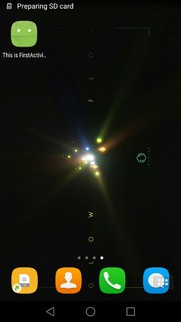
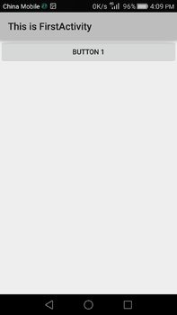

# 从空项目搭建项目

## 创建项目

首先，你需要再新建一个 Android 项目，项目名可以叫做 ActivityTest，包名我们就使用
默认值 com.example.activitytest。我们不勾选 Create Activity 这个选项，因为这次我们准备手动创
建活动，


目前 ActivityTest 项目的 src 目录应该是空的，你应该在 src 目录下先添加一个包。点击
Eclipse 导航栏中的 File→New→Package，在弹出窗口中填入我们新建项目时使用的默认包名
com.example.activitytest，点击 Finish。

## 编写基本代码

现在右击 com.example.activitytest 包→New→Class，会弹出新建类的对话框，我们新建
一个名为 FirstActivity 的类，并让它继承自 Activity，点击 Finish 完成创建。
你需要知道，项目中的任何活动都应该重写 Activity 的 onCreate()方法，但目前我们的
FirstActivity内部还什么代码都没有，所以首先你要做的就是在 FirstActivity中重写 onCreate()方法

```java
public class FirstActivity extends Activity{

    @Override
    protected void onCreate(Bundle savedInstanceState) {
        super.onCreate(savedInstanceState);
    }
}
```

 onCreate()方法非常简单，就是调用了父类的 onCreate()方法。当然这只是默
认的实现，后面我们还需要在里面加入很多自己的逻辑

## 创建和加载布局

Android 程序的设计讲究逻辑和视图分离，最好每一个活动都能对应一
个布局，布局就是用来显示界面内容的，因此我们现在就来手动创建一个布局文件。
右击 res/layout 目录→New→Android XML File，会弹出创建布局文件的窗口。我们给这
个布局文件命名为 first_layout，根元素就默认选择为 LinearLayout


```xml
<?xml version="1.0" encoding="utf-8"?>
<LinearLayout xmlns:android="http://schemas.android.com/apk/res/android"
    android:layout_width="match_parent"
    android:layout_height="match_parent"
    android:orientation="vertical">

    <Button
        android:id="@+id/button_1"
        android:layout_width="match_parent"
        android:layout_height="wrap_content"
        android:text="Button 1"
        />
</LinearLayout>

```
android:id 是给当前的元素定义一个唯一标识符，之后可以在代码中对这个元素进行操作。 你可能会对@+id/button_1 这种语法感到陌生，但如果把加号去掉，变成@id/button_1，这你就会觉得有些熟悉了吧，这不就是在 XML 中引用资源的语法吗，只不过是把 string 替换成了 id。是的，如果你需要在 XML 中引用一个 id，就使用@id/id_name 这种语法，而如果你需要在 XML 中定义一个 id，则要使用@+id/id_name 这种语法


接着在 Activity中加载布局

```java
public class FirstActivity extends Activity{

    @Override
    protected void onCreate(Bundle savedInstanceState) {
        super.onCreate(savedInstanceState);
        setContentView(R.layout.first_layout);
    }
}


```


## 在 AndroidManifest 文件中注册

创建项目时文件是这样的
```java
    <application android:allowBackup="true" android:label="@string/app_name"
        android:icon="@mipmap/ic_launcher" android:theme="@style/AppTheme">

    </application>
```

所有的活动都要在 AndroidManifest.xml 中进行注册才能生效

```java
<manifest xmlns:android="http://schemas.android.com/apk/res/android"
    package="com.example.activitytest">

    <application android:allowBackup="true" android:label="@string/app_name"
        android:icon="@mipmap/ic_launcher" android:theme="@style/AppTheme">

        <activity
            android:name=".FirstActivity"
            android:label="This is FirstActivity">
            <intent-filter>
                <action android:name="android.intent.action.MAIN"/>
                <category android:name="android.intent.category.LAUNCHER"/>
            </intent-filter>
         </activity>

    </application>

</manifest>
```

活动的注册声明要放在<application>标签内，这里是通过<activity>标签来对活动进行注册的。

首先我们要使用 android:name 来指定具体注册哪一个活动。填入的.FirstActivity 是什么意思呢？其实这不过就com.example.activitytest.FirstActivity 的缩写而已。由于最外层的 `<manifest>`标签中已经通过 package 属性指定了程序的包名是com.example.activitytest，因此在注册活动时这一部分就可以省略了，直接使用.FirstActivity就足够了。

然后我们使用了 android:label 指定活动中标题栏的内容，标题栏是显示在活动最顶部的，需要注意的是，给主活动指定的 label 不仅会成为标题栏中的内容，还会成为启动器（ Launcher）中应用程序显示的名称。

之后在`<activity>`标签的内部我们加入了`<intent-filter>`标签，并在这个标签里添加了`<action android:name="android.intent.action.MAIN" />`和`<category android:name="android.intent.category.LAUNCHER" />`这两句声明。
如果你想让 FirstActivity 作为我们这个程序的主活动，即点击桌面应用程序图标时首先打开的就是这个活动，那就一定要加入这两句声明。

另外需要注意，如果你的应用程序中没有声明任何一个活动作为主活动，这个程序仍然是可
以正常安装的，只是你无法在启动器中看到或者打开这个程序。这种程序一般都是作为第三
方服务供其他的应用在内部进行调用的，如支付宝快捷支付服务。

然后就可以跑了

下面是装到手机后的效果，应用名为 label 名




