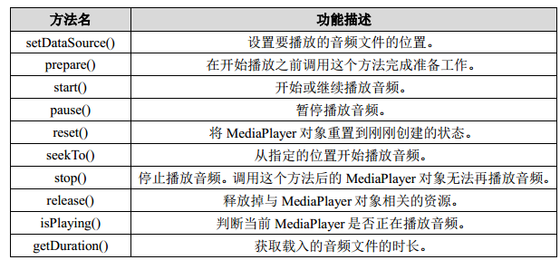

# 播放音频

在 Android 中播放音频文件一般都是使用 MediaPlayer 类来实现的，它对多种格式的音频文件提供了非常全面的控制方法，从而使得播放音乐的工作变得十分简单。下表列出了MediaPlayer 类中一些较为常用的控制方法。



简单了解了上述方法后，我们再来梳理一下 MediaPlayer 的工作流程。首先需要创建出一个MediaPlayer 对象，然后调用 setDataSource()方法来设置音频文件的路径，再调用 prepare()方法使 MediaPlayer进入到准备状态，接下来调用 start()方法就可以开始播放音频，调用 pause()方法就会暂停播放，调用 reset()方法就会停止播放


新建一个 PlayAudioTest 项目，然后修改 activity_main.xml 中的代码，如下所示

```xml
<Button
        android:id="@+id/play"
        android:layout_width="wrap_content"
        android:layout_height="wrap_content"
        android:layout_weight="1"
        android:text="Play" />
    <Button
        android:id="@+id/pause"
        android:layout_width="wrap_content"
        android:layout_height="wrap_content"
        android:layout_weight="1"
        android:text="Pause" />
    <Button
        android:id="@+id/stop"
        android:layout_width="wrap_content"
        android:layout_height="wrap_content"
        android:layout_weight="1"
        android:text="Stop" />
```


布局文件中横向放置了三个按钮，分别用于对音频文件进行播放、暂停和停止操作。然后修改 MainActivity 中的代码，如下所示：


```java

public class MainActivity extends Activity implements View.OnClickListener {


    private Button play;
    private Button pause;
    private Button stop;
    private MediaPlayer mediaPlayer = new MediaPlayer();

    @Override
    protected void onCreate(Bundle savedInstanceState) {
        super.onCreate(savedInstanceState);
        setContentView(R.layout.activity_main);

        play = (Button) findViewById(R.id.play);
        pause = (Button) findViewById(R.id.pause);
        stop = (Button) findViewById(R.id.stop);
        play.setOnClickListener(this);
        pause.setOnClickListener(this);
        stop.setOnClickListener(this);
        initMediaPlayer(); // 初始化MediaPlayer
    }

    private void initMediaPlayer() {
        try {
            File file = new File(Environment.getExternalStorageDirectory(),
                    "music.mp3");
            mediaPlayer.setDataSource(file.getPath()); // 指定音频文件的路径
            mediaPlayer.prepare(); // 让MediaPlayer进入到准备状态
        } catch (Exception e) {
            e.printStackTrace();
        }
    }

    @Override
    public void onClick(View v) {
        switch (v.getId()) {
            case R.id.play:
                if (!mediaPlayer.isPlaying()) {
                    mediaPlayer.start(); // 开始播放
                }
                break;
            case R.id.pause:
                if (mediaPlayer.isPlaying()) {
                    mediaPlayer.pause(); // 暂停播放
                }
                break;
            case R.id.stop:
                if (mediaPlayer.isPlaying()) {
                    mediaPlayer.reset(); // 停止播放
                    initMediaPlayer();
                }
                break;
            default:
                break;
        }
    }

    @Override
    protected void onDestroy() {
        super.onDestroy();
        if (mediaPlayer != null) {
            mediaPlayer.stop();
            mediaPlayer.release();
        }
    }

}
```

可以看到，在类初始化的时候我们就创建了一个 MediaPlayer 的实例，然后在 onCreate()方法中调用了 initMediaPlayer()方法为 MediaPlayer 对象进行初始化操作。在 initMediaPlayer()方法中，首先是通过创建一个 File 对象来指定音频文件的路径，从这里可以看出，我们需要事先在 SD 卡的根目录下放置一个名为 music.mp3 的音频文件。后面依次调用了setDataSource()方法和 prepare()方法为 MediaPlayer 做好了播放前的准备。

接下来我们看一下各个按钮的点击事件中的代码。当点击 Play 按钮时会进行判断，如果当前 MediaPlayer 没有正在播放音频，则调用 start()方法开始播放。当点击 Pause 按钮时会判断，如果当前 MediaPlayer 正在播放音频，则调用 pause()方法暂停播放。当点击 Stop 按钮时会判断，如果当前 MediaPlayer 正在播放音频，则调用 reset()方法将 MediaPlayer 重置为刚刚创建的状态，然后重新调用一遍 initMediaPlayer()方法。

最后在 onDestroy()方法中，我们还需要分别调用 stop()和 release()方法，将与 MediaPlayer
相关的资源释放掉。