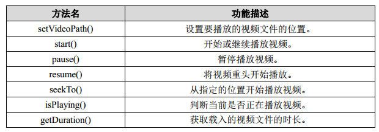

# 播放视频


播放视频文件其实并不比播放音频文件复杂，主要是使用 VideoView 类来实现的。这个类将视频的显示和控制集于一身，使得我们仅仅借助它就可以成一个简易的视频播放器。VideoView 的用法和 MediaPlayer 也比较类似，主要有以下常用方法：



那么我们还是通过一个实际的例子来学习一下吧，新建 PlayVideoTest 项目，然后修改activity_main.xml 中的代码，如下所示：

```xml
<LinearLayout xmlns:android="http://schemas.android.com/apk/res/android"
    android:layout_width="match_parent"
    android:layout_height="match_parent"
    android:orientation="vertical" >
    <VideoView
        android:id="@+id/video_view"
        android:layout_width="match_parent"
        android:layout_height="wrap_content" />
    <LinearLayout
        android:layout_width="match_parent"
        android:layout_height="match_parent" >
        <Button
            android:id="@+id/play"
            android:layout_width="0dp"
            android:layout_height="wrap_content"
            android:layout_weight="1"
            android:text="Play" />
        <Button
            android:id="@+id/pause"
            android:layout_width="0dp"
            android:layout_height="wrap_content"
            android:layout_weight="1"
            android:text="Pause" />
        <Button
            android:id="@+id/replay"
            android:layout_width="0dp"
            android:layout_height="wrap_content"
            android:layout_weight="1"
            android:text="Replay" />
    </LinearLayout>
</LinearLayout>
```

在这个布局文件中，首先是放置了一个 VideoView，稍后的视频就将在这里显示。然后在 VideoView 的下面又放置了三个按钮，分别用于控制视频的播放、暂停和重新播放。接下来修改 MainActivity 中的代码，如下所示：

```java
public class MainActivity extends Activity implements View.OnClickListener {

    private VideoView videoView;
    private Button play;
    private Button pause;
    private Button replay;

    @Override
    protected void onCreate(Bundle savedInstanceState) {
        super.onCreate(savedInstanceState);
        setContentView(R.layout.activity_main);
        play = (Button) findViewById(R.id.play);
        pause = (Button) findViewById(R.id.pause);
        replay = (Button) findViewById(R.id.replay);
        videoView = (VideoView) findViewById(R.id.video_view);
        play.setOnClickListener(this);
        pause.setOnClickListener(this);
        replay.setOnClickListener(this);
        initVideoPath();
    }

    private void initVideoPath() {
        File file = new File(Environment.getExternalStorageDirectory(),
                "video.flv");
        videoView.setVideoPath(file.getPath()); // 指定视频文件的路径
    }
    @Override
    public void onClick(View v) {
        switch (v.getId()) {
            case R.id.play:
                if (!videoView.isPlaying()) {
                    videoView.start(); // 开始播放
                }
                break;
            case R.id.pause:
                if (videoView.isPlaying()) {
                    videoView.pause(); // 暂时播放
                }
                break;
            case R.id.replay:
                if (videoView.isPlaying()) {
                    videoView.resume(); // 重新播放
                }
                break;
        }
    }


    @Override
    protected void onDestroy() {
        super.onDestroy();
        if (videoView != null) {
            videoView.suspend();
        }
    }

}
```

这部分代码相信你理解起来会很轻松，因为它和前面播放音频的代码非常类似。首先在onCreate()方法中仍然是去获取一些控件的实例，然后调用了 initVideoPath()方法来设置视频文件的路径，这里我们需要事先在 SD 卡的根目录下放置一个名为 movie.3gp 的视频文件。下面看一下各个按钮的点击事件中的代码。当点击 Play 按钮时会进行判断，如果当前并没有正在播放音频，则调用 start()方法开始播放。当点击 Pause 按钮时会判断，如果当前视频正在播放，则调用 pause()方法暂时播放。当点击 Replay 按钮时会判断，如果当前视频正在播放，则调用 resume()方法重头播放视频。最后在 onDestroy()方法中，我们还需要调用一下 suspend()方法，将VideoView 所占用的资源释放掉。