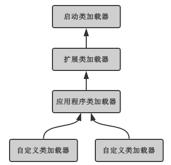

# JVM 类加载的那些事

## 前言

Java源代码被编译成class字节码，最终需要加载到虚拟机中才能运行。整个生命周期包括：**加载、验证、准备、解析、初始化、使用和卸载**7个阶段。


## 加载

通过一个类的全限定名获取描述此类的二进制字节流的过程。虚拟机设计团队把加载动作放到JVM外部实现，以便让应用程序决定如何获取所需的类，实现这个动作的代码称为“类加载器”。

JVM一般提供3种类加载器：

1. 启动类加载器（Bootstrap ClassLoader）负责加载 JAVA_HOME\lib 目录中的，或通过-Xbootclasspath参数指定路径中的，且被虚拟机认可（按文件名识别，如rt.jar）的类。
2. 扩展类加载器（Extension ClassLoader）负责加载 JAVA_HOME\lib\ext 目录中的，或通过java.ext.dirs系统变量指定路径中的类库。
3. 应用程序类加载器（Application ClassLoader）负责加载用户路径（classpath）上的类库。

一般情况，JVM会基于上述类加载器，通过双亲委派模型进行类的加载动作，当然我们也可以通过继承java.lang.ClassLoader实现自定义的类加载器。




双亲委派模型工作过程：当一个类加载器收到类加载任务，优先交给其父类加载器去完成，因此最终加载任务都会传递到顶层的启动类加载器，只有当父类加载器无法完成加载任务时，才会尝试执行加载任务。

双亲委派模型有什么好处？
比如位于rt.jar包中的类java.lang.Object，无论哪个加载器加载这个类，最终都是委托给顶层的启动类加载器进行加载，确保了Object类在各种加载器环境中都是同一个类。


## 验证

为了确保Class文件符合当前虚拟机要求，需要对其字节流数据进行验证，主要包括格式验证、元数据验证、字节码验证和符号引用验证。

1. 格式验证: 验证字节流是否符合class文件格式的规范，并且能被当前虚拟机处理，如是否以魔数0xCAFEBABE开头、主次版本号是否在当前虚拟机处理范围内、常量池是否有不支持的常量类型等。只有经过格式验证的字节流，才会存储到方法区的数据结构，剩余3个验证都基于方法区的数据进行。
2. 元数据验证: 对字节码描述的数据进行语义分析，以保证符合Java语言规范，如是否继承了final修饰的类、是否实现了父类的抽象方法、是否覆盖了父类的final方法或final字段等。
3. 字节码验证: 对类的方法体进行分析，确保在方法运行时不会有危害虚拟机的事件发生，如保证操作数栈的数据类型和指令代码序列的匹配、保证跳转指令的正确性、保证类型转换的有效性等。
4. 符号引用验证: 为了确保后续的解析动作能够正常执行，对符号引用进行验证，如通过字符串描述的全限定名是都能找到对应的类、在指定类中是否存在符合方法的字段描述符等。


## 准备

在准备阶段，为类变量（static修饰）在方法区中分配内存并设置初始值。

```java
private static int var = 100;
```

准备阶段完成后，var 值为0，而不是100。在初始化阶段，才会把100赋值给val，但是有个特殊情况：

```java
private static final int VAL= 100;
```

在编译阶段会为VAL生成ConstantValue属性，在准备阶段虚拟机会根据ConstantValue属性将VAL赋值为100。

## 解析

解析阶段是将常量池中的符号引用替换为直接引用的过程，符号引用和直接引用有什么不同？

1. 符号引用使用一组符号来描述所引用的目标，可以是任何形式的字面常量，定义在Class文件格式中。
2. 直接引用可以是直接指向目标的指针、相对偏移量或则能间接定位到目标的句柄。

## 初始化

初始化阶段是执行类构造器<clinit>方法的过程，<clinit>方法由类变量的赋值动作和静态语句块按照在源文件出现的顺序合并而成，该合并操作由编译器完成。

```java
    private static int value = 100;
    static int a = 100;
    static int b = 100;
    static int c;

    static {
        c = a + b;
        System.out.println("it only run once");
    }
```


1. <clinit>方法对于类或接口不是必须的，如果一个类中没有静态代码块，也没有静态变量的赋值操作，那么编译器不会生成<clinit>；
2. <clinit>方法与实例构造器不同，不需要显式的调用父类的<clinit>方法，虚拟机会保证父类的<clinit>优先执行；
3. 为了防止多次执行<clinit>，虚拟机会确保<clinit>方法在多线程环境下被正确的加锁同步执行，如果有多个线程同时初始化一个类，那么只有一个线程能够执行<clinit>方法，其它线程进行阻塞等待，直到<clinit>执行完成。
4. 注意：执行接口的<clinit>方法不需要先执行父接口的<clinit>，只有使用父接口中定义的变量时，才会执行。

## 类初始化场景

虚拟机中严格规定了有且只有5种情况必须对类进行初始化。

- 执行new、getstatic、putstatic和invokestatic指令；
- 使用reflect对类进行反射调用；
- 初始化一个类的时候，父类还没有初始化，会事先初始化父类；
- 启动虚拟机时，需要初始化包含main方法的类；
- 在JDK1.7中，如果java.lang.invoke.MethodHandler实例最后的解析结果REF_getStatic、REF_putStatic、REF_invokeStatic的方法句柄，并且这个方法句柄对应的类没有进行初始化；

不过下面几种情况，并不会触发类初始化动作。

**1、通过子类引用父类的静态字段，只会触发父类的初始化，而不会触发子类的初始化。**

```java
class Parent {
    static int a = 100;
    static {
        System.out.println("parent init！");
    }
}

class Child extends Parent {
    static {
        System.out.println("child init！");
    }
}

public class Init{  
    public static void main(String[] args){  
        System.out.println(Child.a);  
    }  
}
```

输出结果为：parent init！

**2、定义对象数组，不会触发该类的初始化。**

```java
public class Init{  
    public static void main(String[] args){  
        Parent[] parents = new Parent[10];
    }  
}
```

无输出，说明没有触发类Parent的初始化，但是这段代码做了什么？先看看生成的字节码指令


anewarray指令为新数组分配空间，并触发[Lcom.ctrip.ttd.whywhy.Parent类的初始化，这个类由虚拟机自动生成。

**3、常量在编译期间会存入调用类的常量池中，本质上并没有直接引用定义常量的类，不会触发定义常量所在的类。**


```java
class Const {
    static final int A = 100;
    static {
        System.out.println("Const init");
    }
}

public class Init{  
    public static void main(String[] args){  
        System.out.println(Const.A);  
    }  
}
```

无输出，说明没有触发类Const的初始化，在编译阶段，Const类中常量A的值100存储到Init类的常量池中，这两个类在编译成class文件之后就没有联系了。