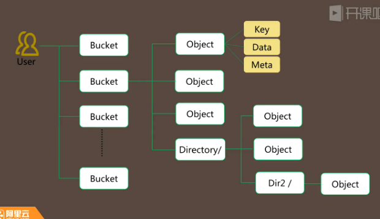

# OSS （Object Storage Service，对象存储）

### 产品和架构

OSS是阿里云对外提供的海量、安全和高可靠的云存储服务。RESTFul API的平台无关性，容量和处理能力的弹性扩展，按实际容量付费真正使您专注于核心业务

视频，音频，图像 通常称为**非结构化数据**
OSS是用来存储这个数据的服务

用来存储大量不同大小，格式的非结构化数据

单个数据从单个字节到48.8T，

### OSS特点

具有**海量，安全，高性能，高可靠性，低成本**的特点

**稳定**：
构建在阿里云飞天平台上，服务可用性99.9％
数据三重备份，可靠性达99.9999999%，10个9

**安全**：
多层次安全和防护DDOS攻击
多用户隔离
提供访问日志有助于追查非法访问

**高性能**：
大规模，存储容量无限扩展
多线BGP网络确保全国各地访问流畅

### OSS在企业的位置

### OSS基本概念

1. Object:用户的每个文件都是一个Object
文件大小限制：Put Object方式最大不能超过5GB
使用multipart上传方式Object大小不能超过48.8T
包含key,data,meta data

2. Bucket
Object的一个集合，每个Object必须包含在bucket章
bucket在整个OSS中具有全局唯一性，且不能修改
一个用户最多可创建10个Bucket
每个bucket中存放的object数量和大小总和没有限制，跟购买的空间有关

3. service
提供给用户的**虚拟存储空间**
用户可以在这个存储空间中拥有一个或多个bucket

4. access id access key
用来标识用户，为访问OSS做签名认证
API密钥

OSS不存在目录这个物理的，只是加了个/，用来表示目录，更加方便

## 创建bucket后如果用OSS访问

HTTP协议访问

http://<bucket>.oss.aliyuncs.com/pathname/to/object

浏览器进入到OSS，SLB/LVS负载均衡服务

负载均衡层会转发到协议接入层，负责把协议处理和访问控制，

然后是分布式架构数据访问层，key-value，分区索引

然后是持久存储层，最终用来持久化，冗余，容错

## OSS架构

数据访问层 LockServoce KVMaster 多个KVServer

持久存储层 3个master，多个chunk server

