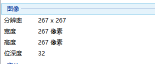
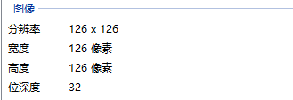

# 位深度(color depth/bit depth)

计算机之所以能够显示颜色，是采用了一种称作“位”( bit ) 的记数单位来记录所表示颜色的数据。当这些数据按照一定的编排方式被记录在计算机中，就构成了一个数字图像的计算机文件。“位”( bit )是计算机存储器里的最小单元，它用来记录每一个像素颜色的值。**图像的色彩越丰富，“位”就越多**。每一个像素在计算机中所使用的这种位数就是“位深度”。

**在记录数字图像的颜色时，计算机实际上是用每个像素需要的位深度来表示的**。

黑白二色的图像是数字图像中最简单的一种(monochrome(单色))，它只有黑、白两种颜色，也就是说它的每个像素只有1位颜色，位深度是1，用2的一次幂来表示；

考虑到位深度平均分给R, G, B和Alpha，而只有RGB可以相互组合成颜色。所以4位颜色的图，它的位深度是4，只有2的4次幂种颜色，即16种颜色或16种灰度等级 ) 。

8位颜色的图，位深度就是8，用2的8次幂表示，它含有256种颜色 ( 或256种灰度等级 )。

**24位颜色可称之为真彩色(True color)**，位深度是24，它能组合成2的24次幂种颜色，即：16777216种颜色 ( 或称千万种颜色 )，超过了人眼能够分辨的颜色数量。当我们用24位来记录颜色时，实际上是以2^（8×3），即红、绿、蓝 ( RGB ) 三基色各以2的8次幂，256种颜色而存在的，三色组合就形成一千六百万种颜色。

## 举例

以迅雷的logo作为实例，侵权即删。

图1是原图，图2是用`www.tinypng.com`压缩后的图片，图3使用`http://www.gaitubao.com/`压缩大小之后的图片

图1

原图的图像信息如下

图2

经过tinypng压缩后的图像信息如下：

图3

经过gaitubao压缩后的图像信息如下：

**结论：**

- `www.tinypng.com`压缩图片，修改了位深度，而不修改像素；因为不改变像素大小，所以图片可以一样大，只是每个像素点的颜色没有那么的"真"
- - `http://www.gaitubao.com/`压缩图片是修改像素大小，而不修改位深度。改变了像素大小，当然图片就小了，但是每个像素的图片都是"真的"。

