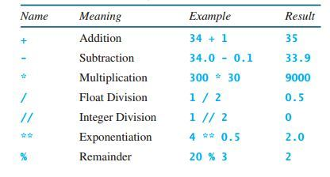
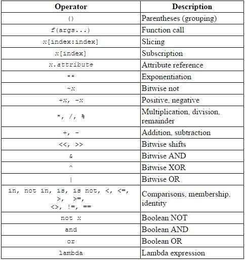
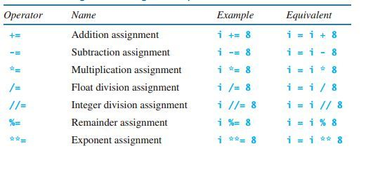

# Python numbers & operators


Python 支持3中不同的数字类型：**int, float, complex**(复数)


## Integers & Floats & Complex number

在 Python 整型常量属于 `int` 类

```python
>>> i = 100
>>> i

>>> f = 12.3
>>> f
12.3

>>> x = 2 + 3j # where 2 is the real part and 3 is imaginary(假想的)
```

## Determining types

使用 type 内置函数判断变量类型

```
>>> x = 12
>>> type(x)
 <class 'int'>
```

## Python operators

Python中拥有不同的运算符，让我们能够在程序中进行所需的计算



其中`+`，`-`，`*`，`%`的运算和其他编程语言的运算结果一样；

### Division

`/`： 浮点数除法
`//` : 整数除法(这个才是一般我们见过的运算规则)

```python
>>> 3/2 
1.5

>>> 3//2 
1
```
也就是说 python 将 `/` 修改为默认进行浮点数运算, 不用再考虑类似 `3/2` 需要写成 `3.0/2` 的问题

注意：在python2.7中, `/`和`//`都是进行整数除法，在python3中将`/`表示成浮点数除法，而`//`依然是整数除法

### Exponentiation

python中有幂运算符 `**` 

`a* b` 表示 `a^b` (a的b次方)

```python
>>> 2 ** 3 # is same as 2 * 2 * 2
8
```


## Operator Precedence

下面的图片展示了 python 中运算符优先级从高到低的排列




## Augmented Assignment Operator

同样的，python 也有增强赋值运算符

