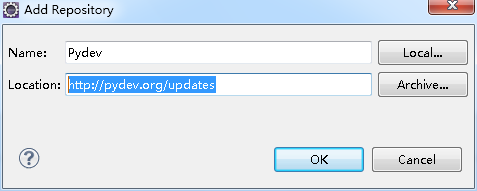
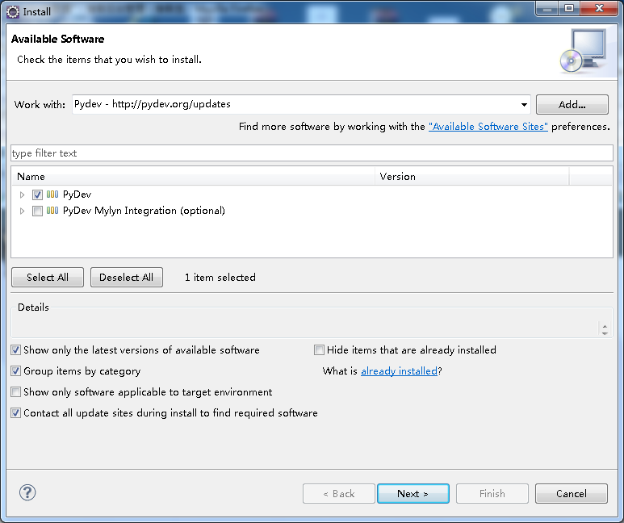
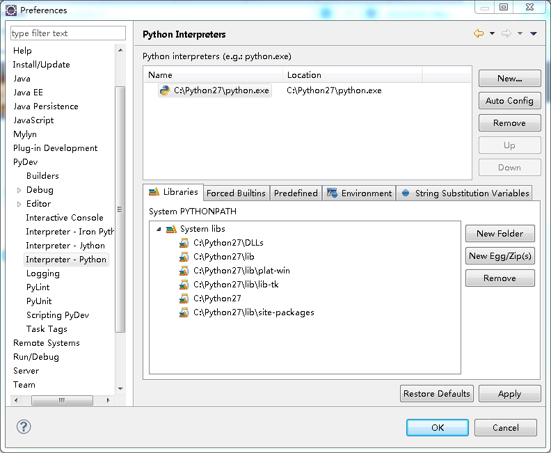
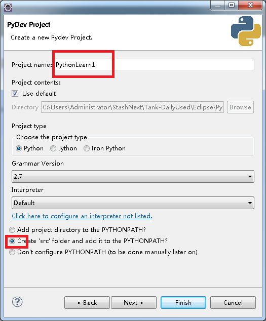
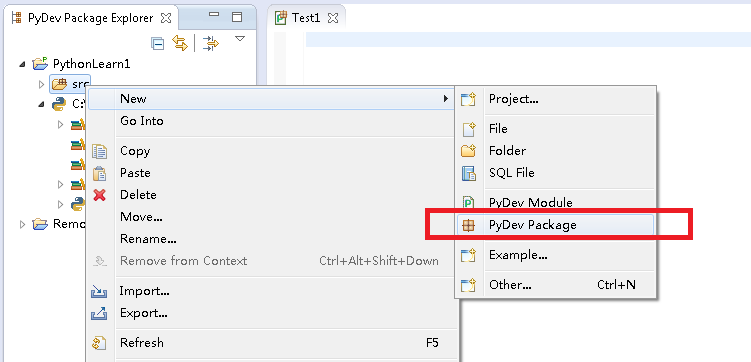
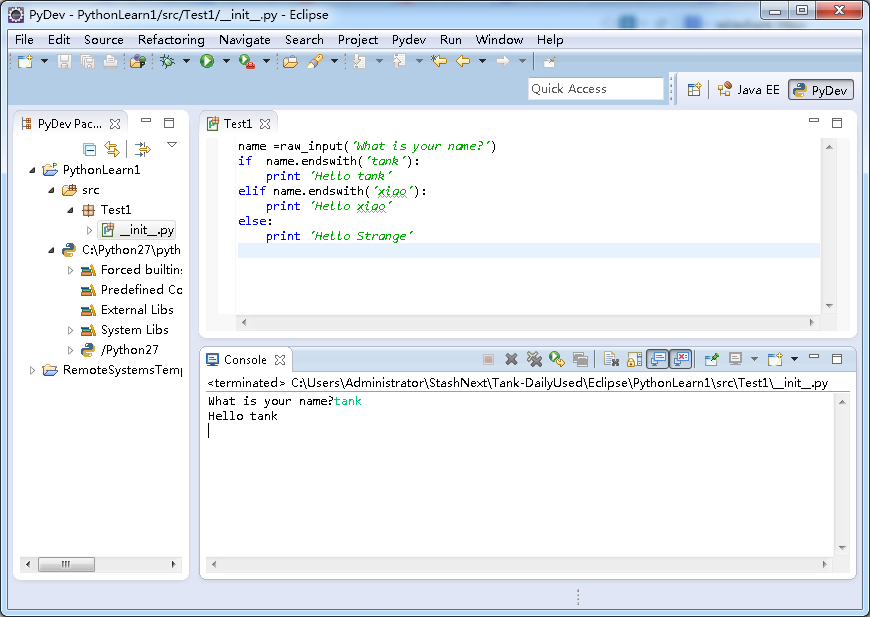

# Eclipse 安装 Python 插件

假设已经配置了Java环境变量，即在有配置了JDK基础上进行安装

启动Eclipse, 点击Help->Install New Software...   在弹出的对话框中，点Add 按钮。  Name中填:Pydev,  Location中填http://pydev.org/updates

然后一步一步装下去。  如果装的过程中，报错了。 就重新装。

安装好pydev后， 需要配置Python解释器。

在Eclipse菜单栏中，点击Windows ->Preferences.   

在对话框中，点击pyDev->Interpreter - Python.  点击New按钮， 选择python.exe的路径, 打开后显示出一个包含很多复选框的窗口. 点OK

如果是Mac系统， 点击“Auto Config” 按钮

## 开始写代码

启动Eclipse,  创建一个新的项目,   File->New->Projects...   选择PyDev->PyDevProject 输入项目名称

新建 pyDev Package.    就可以写代码了。

输入包名，这里输入Test1

