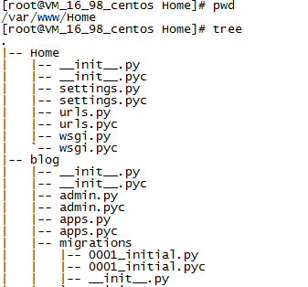

# linux 部署 django 到 Apache

这篇文章假设可以通过命令行(python manage.py runserver 0.0.0.0:80)启动成功，也就是说基本环境已经搭建好，也就是完成了以下工作：

- 安装apache
- 安装Django模块
- a安装MySQL(如果有)和相应的模块如MySQL-python

## 第一步 安装mod_wsgi 模块

最简单的方法是输入命令安装：

```linux
sudo yum install mod_wsgi
```

如果你是ubuntu 的话就输入：

```linux
sudo apt-get install libapache2-mod-wsg #这个是python2.×的
sudo apt-get install libapache2-mod-wsgi-py3 #这个是python3.×的
```

> windows：
下载地址：http://www.lfd.uci.edu/~gohlke/pythonlibs/#mod_wsgi
如win7 64位、python 2.7.6、apache（httpd-2.4.10）对应版本为：mod_wsgi-3.5.ap24.win-amd64-py2.7.zip
解压之后将得到一个mod_wsgi.so 文件，将其拷贝到Apache24\modules\目录下。然后直接第三步类似操作

## 第二步 检查mod_wsgi安装情况

 默认情况下，无论ubuntu还是red hat ，安装完后都会自动在apache配置文件中加入：

LoadModule wsgi_module modules/mod_wsgi.so
表示载入该模块了。没有的话就手动一下吧。

rpm -ql grep mod_wsgi-3.4* 查看，可以看到这行`/usr/lib64/httpd/modules/mod_wsgi.so`将这个拷贝到 Apache24\modules\ 目录下

命令：

```linux
rpm -qa | grep httpd　　　　　 ＃[搜索指定rpm包是否安装]--all搜索*httpd*
rpm -ql httpd　　　　　　　　　＃[搜索rpm包]--list所有文件安装目录
```

## 第三步 配置wsgi


重申假设：

django项目路径为“/var/www/Home”（项目名为Home）,apache 配置文件为“/usr/local/apache”。




打开 `/usr/local/apache/conf/httpd.conf`,加入如下配置：

```apache
#添加mod_wsgi.so 模块
LoadModule wsgi_module modules/mod_wsgi.so

#指定myweb项目的wsgi.py配置文件路径
WSGIScriptAlias / /var/www/Home/Home/wsgi.py

#指定项目路径
WSGIPythonPath /var/www/Home

<Directory /var/www/Home/Home>
<Files wsgi.py>
    Require all granted
</Files>
</Directory>
```

> 对windows只是对目录改一下就可以了

wsgi.py 在一开始生成djnago项目时这些信息就已经自动生成，其实我们不用对其做任何修改。

打开settings.py文件添加：

```python
ALLOWED_HOSTS = ['127.0.0.1', 'localhost', '.bensonlin.me']
#最后一个假设是自己的域名
```

## 对静态文件进行处理

## 启动测试

然后重启或启动 /usr/local/apache/bin/apachectl start(restart)

然后访问 www.bensonlin.me 就可以了找到