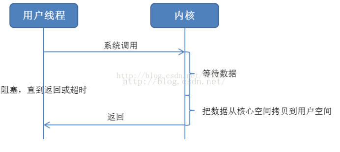
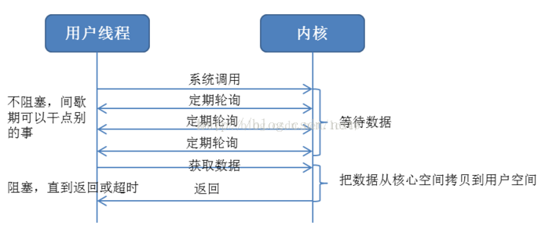
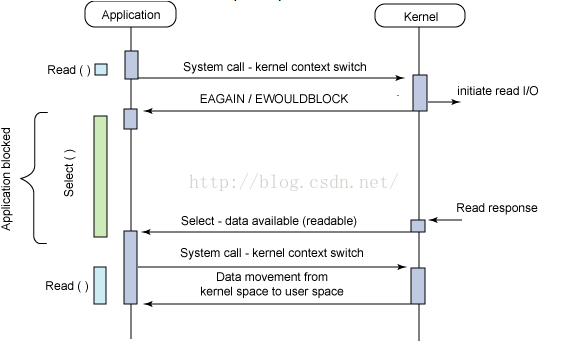
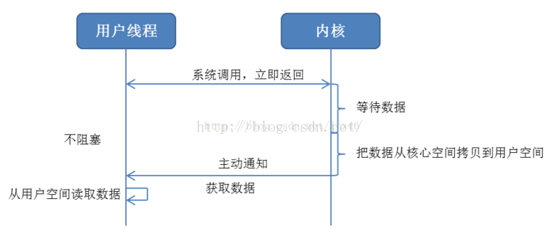

## 一、同步阻塞

这是早期Linux常用的IO方式，在这个模型中，用户空间的应用程序执行一个系统调用，这会导致应用程序阻塞。这意味着应用程序会一直阻塞，直到系统调用完成为止（数据传输完成或发生错误）。调用应用程序处于一种不再消费 CPU 而只是简单等待响应的状态，因此从处理的角度来看，这是非常有效的。下图给出了传统的阻塞 I/O 模型，这也是目前应用程序中最为常用的一种模型。其行为非常容易理解，其用法对于典型的应用程序来说都非常有效。在调用 read 系统调用时，应用程序会阻塞并对内核进行上下文切换。然后会触发读操作，当响应返回时（从我们正在从中读取的设备中返回），数据就被移动到用户空间的缓冲区中。然后应用程序就会解除阻塞（read 调用返回）。




## 二、同步非阻塞 I/O
同步阻塞 I/O 的一种效率稍低的变种是同步非阻塞 I/O。在这种模型中，设备是以非阻塞的形式打开的。这意味着 I/O 操作不会立即完成，read操作可能会返回一个错误代码，说明这个命令不能立即满足（EAGAIN 或 EWOULDBLOCK），如图 2 所示。



非阻塞的实现是 I/O 命令可能并不会立即满足，需要应用程序调用许多次来等待操作完成。这可能效率不高，因为在很多情况下，当内核执行这个命令时，应用程序必须要进行忙碌等待，直到数据可用为止，或者试图执行其他工作。正如图 3 所示的一样，这个方法可以引入 I/O 操作的延时，因为数据在内核中变为可用到用户调用 read 返回数据之间存在一定的间隔，这会导致整体数据吞吐量的降低。

## 三、异步阻塞方式

另外一个阻塞解决方案是带有阻塞通知的非阻塞 I/O。在这种模型中，配置的是非阻塞 I/O，然后使用阻塞 select 系统调用来确定一个 I/O 描述符何时有操作。使 select 调用非常有趣的是它可以用来为多个描述符提供通知，而不仅仅为一个描述符提供通知。对于每个提示符来说，我们可以请求这个描述符可以写数据、有读数据可用以及是否发生错误的通知。





## 四、异步非阻塞方式


最后，异步非阻塞 I/O 模型是一种处理与 I/O 重叠进行的模型。读请求会立即返回，说明 read 请求已经成功发起了。在后台完成读操作时，应用程序然后会执行其他处理操作。当 read 的响应到达时，就会产生一个信号或执行一个基于线程的回调函数来完成这次 I/O 处理过程。




在一个进程中为了执行多个 I/O 请求而对计算操作和 I/O 处理进行重叠处理的能力利用了处理速度与 I/O 速度之间的差异。当一个或多个 I/O 请求挂起时，CPU 可以执行其他任务；或者更为常见的是，在发起其他 I/O 的同时对已经完成的 I/O 进行操作。

## 五、同步与异步
同步/异步, 它们是消息的通知机制

### 1. 概念解释

**A. 同步**

所谓同步，就是在发出一个功能调用时，在没有得到结果之前，该调用就不返回。

按照这个定义，**其实绝大多数函数都是同步调用（**例如sin isdigit等），其实AJAX异步也是同步，因为都是等待结果才返回。
但是一般而言，我们在说同步、异步的时候，特指那些需要其他部件协作或者需要一定时间完成的任务。
最常见的例子就是 SendMessage。
该函数发送一个消息给某个窗口，在对方处理完消息之前，这个函数不返回。
当对方处理完毕以后，该函数才把消息处理函数所返回的值返回给调用者。

**B. 异步**

异步的概念和同步相对。
当一个异步过程调用发出后，调用者不会立刻得到结果。
实际处理这个调用的部件是在调用发出后，
通过状态、通知来通知调用者，或通过回调函数处理这个调用。

以 Socket为例，
当一个客户端通过调用 Connect函数发出一个连接请求后，调用者线程不用等待结果，可立刻继续向下运行。
当连接真正建立起来以后，socket底层会发送一个消息通知该对象。

**C. 三种返回结果途径 **

执行部件和调用者可以通过三种途径返回结果：
a.   状态、
b.   通知、
c.   回调函数。

可以使用哪一种依赖于执行部件的实现，除非执行部件提供多种选择，否则不受调用者控制。

a. 如果执行部件用状态来通知，
    那么调用者就需要每隔一定时间检查一次，效率就很低
    有些初学多线程编程的人，总喜欢用一个循环去检查某个变量的值，这其实是一种很严重的错误。

b. 如果是使用通知的方式，
    效率则很高，因为执行部件几乎不需要做额外的操作。

c. 至于回调函数，
    和通知没太多区别。


### 2. 举例说明

理解这两个概念，可以用去银行办理业务(可以取钱，也可以存钱)来比喻:
当到银行后,
.可以去ATM机前排队等候                                -- (排队等候)就是同步等待消息
.可以去大厅拿号,等到排到我的号时，
 柜台的人会通知我轮到我去办理业务.              -- (等待别人通知)就是异步等待消息.

在异步消息通知机制中,
等待消息者(在这个例子中就是等待办理业务的人)往往注册一个回调机制,
在所等待的事件被触发时由触发机制(在这里是柜台的人)通过某种机制(在这里是写在小纸条上的号码)
找到等待该事件的人.

在select/poll 等IO 多路复用机制中就是fd,
当消息被触发时,触发机制通过fd 找到处理该fd的处理函数.

### 3. 实际的程序中

同步消息通知机制：就好比简单的read/write 操作,它们需要等待这两个操作成功才能返回;
                  同步, 是由处理消息者自己去等待消息是否被触发;
异步消息通知机制：类似于select/poll 之类的多路复用IO 操作,
                  当所关注的消息被触发时,由消息触发机制通知触发对消息的处理.
                  异步, 由触发机制来通知处理消息者;


还是回到上面的例子,
轮到你办理业务, 这个就是你关注的消息,
而办理什么业务, 就是对这个消息的处理,
两者是有区别的.

而在真实的IO 操作时: 所关注的消息就是     该fd是否可读写,
                     而对消息的处理是     对这个fd 进行读写.

同步/异步仅仅关注的是如何通知消息,它们对如何处理消息并不关心,
好比说,银行的人仅仅通知你轮到你办理业务了,
而办理业务什么业务(存钱还是取钱)他们是不知道的.

## 六、阻塞与非阻塞

阻塞/非阻塞, 它们是**程序在等待消息(无所谓同步或者异步)时的状态**.

### 1. 概念解释

**A. 阻塞**

阻塞调用是指调用结果返回之前，当前线程会被挂起。函数**只有在得到结果之后才会返回**。
有人也许会把阻塞调用和同步调用等同起来，实际上他是不同的。
对于同步调用来说，很多时候当前线程还是激活的，只是从逻辑上当前函数没有返回而已。

socket接收数据函数recv是一个阻塞调用的例子。
当socket工作在阻塞模式的时候， 如果没有数据的情况下调用该函数，则当前线程就会被挂起，直到有数据为止。

**B. 非阻塞**

非阻塞和阻塞的概念相对应，指在不能立刻得到结果之前，该函数不会阻塞当前线程，而会立刻返回。

**C. 对象的阻塞模式和阻塞函数调用**

对象是否处于阻塞模式和函数是不是阻塞调用有很强的相关性，但是并不是一一对应的。


阻塞对象上可以有非阻塞的调用方式，我们可以通过一定的API去轮询状态，
在适当的时候调用阻塞函数，就可以避免阻塞。
而对于非阻塞对象，调用特殊的函数也可以进入阻塞调用。函数select就是这样的一个例子。

### 2. 举例说明

继续上面的那个例子,
不论是排队等待，还是使用号码等待通知,
如果在这个等待的过程中,
. 等待者除了等待消息之外不能做其它的事情,那么该机制就是阻塞的,
  表现在程序中,也就是该程序一直阻塞在该函数调用处不能继续往下执行.
. 相反,有的人喜欢在银行办理这些业务的时候一边打打电话发发短信一边等待,这样的状态就是非阻塞的,
  因为他(等待者)没有阻塞在这个消息通知上,而是一边做自己的事情一边等待.

## 七、易混淆的点

很多人也会把异步和非阻塞混淆,
因为异步操作一般都不会在真正的IO 操作处被阻塞,
比如如果用select 函数,当select 返回可读时再去read 一般都不会被阻塞
就好比当你的号码排到时一般都是在你之前已经没有人了,所以你再去柜台办理业务就不会被阻塞.
可见,同步/异步与阻塞/非阻塞是两组不同的概念,它们可以共存组合,

而很多人之所以把同步和阻塞混淆,我想也是因为没有区分这两个概念,
比如阻塞的read/write 操作中,其实是把消息通知和处理消息结合在了一起,
在这里所关注的消息就是fd 是否可读/写,而处理消息则是对fd 读/写.
当我们将这个fd 设置为非阻塞的时候,read/write 操作就不会在等待消息通知这里阻塞,
如果fd 不可读/写则操作立即返回.


## 八、同步/异步与阻塞/非阻塞的组合分析

```java
        阻塞					    非阻塞
同步   同步阻塞                同步非阻塞
异步   异步阻塞                异步非阻塞
```

**同步阻塞形式:**

  效率是最低的，
  拿上面的例子来说，就是你专心排队，什么别的事都不做。

  实际程序中
  就是未对fd 设置O_NONBLOCK 标志位的read/write 操作,

**异步阻塞形式:**

  如果在银行等待办理业务的人采用的是异步的方式去等待消息被触发,也就是领了一张小纸条,
  假如在这段时间里他不能离开银行做其它的事情,那么很显然,这个人被阻塞在了这个等待的操作上面;


  异步操作是可以被阻塞住的,只不过它不是在处理消息时阻塞,而是在等待消息被触发时被阻塞.
  比如select 函数,
  假如传入的最后一个timeout 参数为NULL,那么如果所关注的事件没有一个被触发,
  程序就会一直阻塞在这个select 调用处.

**同步非阻塞形式:**

  实际上是效率低下的,
  想象一下你一边打着电话一边还需要抬头看到底队伍排到你了没有,
  如果把打电话和观察排队的位置看成是程序的两个操作的话,
  这个程序需要在这两种不同的行为之间来回的切换,效率可想而知是低下的;

  很多人会写阻塞的read/write 操作,
  但是别忘了可以对fd 设置O_NONBLOCK 标志位,这样就可以将同步操作变成非阻塞的了;

**异步非阻塞形式:**

  效率更高,
  因为打电话是你(等待者)的事情,而通知你则是柜台(消息触发机制)的事情,
  程序没有在两种不同的操作中来回切换.

  比如说，这个人突然发觉自己烟瘾犯了,需要出去抽根烟,
  于是他告诉大堂经理说,排到我这个号码的时候麻烦到外面通知我一下(注册一个回调函数),
  那么他就没有被阻塞在这个等待的操作上面,自然这个就是异步+非阻塞的方式了.

  如果使用异步非阻塞的情况,
  比如aio_*组的操作,当发起一个aio_read 操作时,函数会马上返回不会被阻塞,
  当所关注的事件被触发时会调用之前注册的回调函数进行处理.


## 九、epoll模型：

1、select是几乎所有unix、linux都支持的一种多路IO方式，通过select函数发出IO请求后，线程阻塞，一直到数据准备完毕，然后才能把数据从核心空间拷贝到用户空间，所以select是同步阻塞方式。int select(int n, fd_set *readfds, fd_set *writefds, fd_set *exceptfds, struct timeval *timeout);

2、poll对select的使用方法进行了一些改进，突破了最大文件数的限制，同时使用更加方便一些。

```c
int poll(struct pollfd *ufds, unsigned int nfds, int timeout);

struct pollfd {

   int fd;           /* 对应的文件描述符 */

   short events;     /* 要监听的事件，例如POLLIN|POLLPRI */

  short revents;    /* 返回的事件，用于在poll返回时携带该fd上发生的事情，在poll调用时，该字段会自动被清空 */};
```

通过poll函数发出IO请求后，线程阻塞，直到数据准备完毕，poll函数在pollfd中通过revents字段返回事件，然后线程把数据从核心空间拷贝到用户空间，所以poll同样是同步阻塞方式，性能同select相比没有改进。

3、epoll是linux为了解决select/poll的性能问题而新搞出来的机制，基本的思路是：由专门的内核线程来不停地扫描fd列表，有结果后，把结果放到fd相关的链表中，用户线程只需要定期从该fd对应的链表中读取事件就可以了。同时，为了节省把数据从核心空间拷贝到用户空间的消耗，采用了mmap的方式，允许程序在用户空间直接访问数据所在的内核空间，不需要把数据copy一份。epoll一共有3个函数：

- 创建epoll文件描述符
int epoll_create(int size)；

- 把需要监听的文件fd和事件加入到epoll文件描述符，也可以对已有的fd进行修改和删除
文件fd保存在一个红黑树中，该fd的事件保存在一个链表中（每个fd一个事件链表），事件由内核线程负责填充，用户线程读取

	```c
	int epoll_ctl(int epfd, int op, int fd, struct epoll_event *event)；
	            typedef union epoll_data {
	                void *ptr;
	                int fd;
	                __uint32_t u32;
	                __uint64_t u64;
	            } epoll_data_t;
	
	
	            struct epoll_event {
	                __uint32_t events;      /* Epoll events */
	                epoll_data_t data;      /* User data variable */
	            };
	```

	用户线程定期轮询epoll文件描述符上的事件，事件发生后，读取事件对应的epoll_data，该结构中包含了文件fd和数据地址，由于采用了mmap，程序可以直接读取数据。
	
	```c
	int epoll_wait(int epfd, struct epoll_event * events, int maxevents, int timeout);
	```

	有人把epoll这种方式叫做同步非阻塞（NIO），因为用户线程需要不停地轮询，自己读取数据，看上去好像只有一个线程在做事情
	也有人把这种方式叫做异步非阻塞（AIO），因为毕竟是内核线程负责扫描fd列表，并填充事件链表的

个人认为真正理想的异步非阻塞，应该是内核线程填充事件链表后，主动通知用户线程，或者调用应用程序事先注册的回调函数来处理数据，如果还需要用户线程不停的轮询来获取事件信息，就不是太完美了，所以也有不少人认为epoll是伪AIO，还是有道理的。


## 小结

其实同步异步就是在获取结果的时候会不会停止其他操作，而阻塞非阻塞是指在处理过程中需不需要等待，可不可以做其它事


1. ATM取钱---只能一直等待，等待期间不能做任何事，同步阻塞
          	
2. 柜台牌号

	拿到牌号可以玩手机，但是要不断的关注屏幕，等有结果了，需要停止其它事，同步非阻塞；
	拿到号码就不管了，可以玩手机，即使到了，有服务员帮你做好，最后只是告诉你好了，异步阻塞；
	拿到号码后还是不能干其它事 异步阻塞；