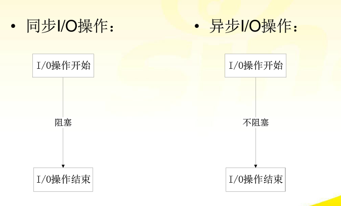

# 网络IO之阻塞、非阻塞、同步、异步总结

[转载地址](http://www.cnblogs.com/Anker/p/3254269.html)

## 1、前言

　　在网络编程中，阻塞、非阻塞、同步、异步经常被提到。

## 2、数据流向

　　网络IO操作实际过程涉及到内核和调用这个IO操作的进程。以read为例，read的具体操作分为以下两个部分:
　　（1）内核等待数据可读
　　（2）将内核读到的数据拷贝到进程

详细过程如下图所示：

图1

## 3、网络IO模型详细分析

　　常见的IO模型有**阻塞、非阻塞、IO多路复用，异步**。以一个生动形象的例子来说明这四个概念。周末我和女友去逛街，中午饿了，我们准备去吃饭。周末人多，吃饭需要排队，我和女友有以下几种方案：

**（1）**我和女友点完餐后，不知道什么时候能做好，只好坐在餐厅里面等，直到做好，然后吃完才离开。女友本想还和我一起逛街的，但是不知道饭能什么时候做好，只好和我一起在餐厅等，而不能去逛街，直到吃完饭才能去逛街，中间等待做饭的时间浪费掉了。这就是典型的阻塞。

网络中IO阻塞如下图所示：从图1分析，就是**在内核空间准备数据的时候，因为数据为准备好，所以阻塞了，等待了**

**（2）**我女友不甘心白白在这等，又想去逛商场，又担心饭好了。所以我们逛一会，回来询问服务员饭好了没有，来来回回好多次，饭都还没吃都快累死了啦。这就是**非阻塞**。需要不断的询问，是否准备好了。网络IO非阻塞如下图所示：从图1分析，就是**在内核空间读数据的时候，虽然未读取完毕，但是我们不用等待，可以干其他事，所以是非阻塞的**

**（3）**你有多个女友都要在那里吃饭，然后你苦逼的在餐厅等着不断询问几个女友的饭是否有好了的，这时你的女友们就可以出去继续逛街，然后你一但发现某个女友的饭好了就打电话通知该女友来吃饭！，这就是典型的IO多路复用，如select、poll、epoll。网络IO具体模型如下图所示：从图1分析，就是**在内核空间完毕时，告知某个已经好了的进程**

**（4）**女友不想逛街，又餐厅太吵了，回家好好休息一下。于是我们叫外卖，打个电话点餐，然后我和女友可以在家好好休息一下，饭好了送货员送到家里来。这就是典型的异步，只需要打个电话说一下，然后可以做自己的事情，饭好了就送来了。linux提供了AIO库函数实现异步，但是用的很少。目前有很多开源的异步IO库，例如libevent、libev、libuv。异步过程如下图所示：从图1分析，就是**在内核空间读数据的时候，虽然未读取完毕，但是我们不用等待，可以干其他事，而且在将内核空间读取到用户态时也不需要等待，进程只需要从用户态读，而不是在拷贝到用户态没拷贝完成就等待，所以就是异步的过程，主要体现在第二个过程**

## 4、同步与异步

　　实际上同步与异步是针对应用程序与内核的交互而言的。同步过程中进程触发IO操作并等待或者轮询的去查看IO操作是否完成，直到IO操作完成后才醒来继续执行。异步过程中进程触发IO操作以后，直接返回，做自己的事情，IO交给内核来处理，完成后内核通知进程IO完成。同步与异步如下图所示：

　　如果IO请求需要大量时间执行的话，异步文件IO方式可以显著提高效率，因为在线程等待的这段时间内，CPU将会调度其他线程进行执行，如果没有其他线程需要执行的话，这段时间将会浪费掉（可能会调度操作系统的零页线程）。如果IO请求操作很快，用异步IO方式反而还低效，还不如用同步IO方式。

## 5、阻塞与非阻塞

　　简单理解为需要做一件事能不能立即得到返回应答，如果不能立即获得返回，需要等待，那就阻塞了，否则就可以理解为非阻塞。详细区别如下图所示：

**阻塞，非阻塞**：进程/线程要访问的数据**是否就绪**，进程/线程是否需要等待；
**同步，异步**：访问数据的方式，同步需要主动读写数据，在读写数据的过程中还是会阻塞；异步只需要I/O操作完成的通知，并不主动读写数据，由操作系统内核完成数据的读写。