# 图像压缩原理

[转载地址](http://blog.csdn.net/newchenxf/article/details/51693753)

## 1. 图像可压缩的原因
一张原始图像(1920x1080)，如果每个像素32bit表示（RGBA），那么，图像需要的内存大小 
1920x1080x4 = 8294400 Byte，大约8M。这我们是万万不能接受的。如果这样，1G硬盘才存100多张图片，伤不起啊！视频也一样，如果视频是1920x1080，30fps， 1小时。那不压缩大概需要的内存： 
8Mx30x60*60 = 864000M，都800多G了！疯了吧！

所以说，我们需要图像压缩。

那图像为何可以压缩呢？因为它有很多冗余信息。 
常见图像、视频、音频数据中存在的冗余类型如下： 
1. 空间冗余 
2. 时间冗余 
3. 视觉冗余 
下面详细介绍。

### 1.1. 空间冗余

一幅图像表面上各采样点的颜色之间往往存在着空间连贯性，比如下图，两只老鼠的颜色，背后的墙，灰色的地板，颜色都一样。这些颜色相同的块就可以压缩。 

比如说，第一行像素基本都一样，假设亮度值Y是这么存的 
[105 105 105…….105]，如果共100个像素，那需要1Byte*100。 
最简单的压缩：[105, 100]，表示接下来100个像素的亮度都是105，那么只要2个字节，就能表示整行数据了！岂不是压缩了！ 

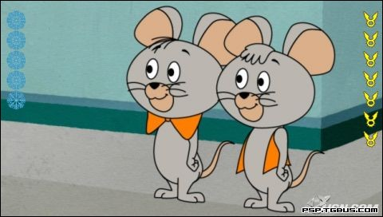

空间冗余主要发生在单张图片，比如我们的照片。

## 1.2. 时间冗余

这种冗余主要**针对视频**。 
运动图像（视频）一般为位于一时间轴区间的一组连续画面，其中的相邻帧往往包含相同的背景和移动物体，只不过移动物体所在的空间位置略有不同，所以后一帧的数据与前一帧的数据有许多共同的地方，这种共同性是由于相邻帧记录了相邻时刻的同一场景画面，所以称为时间冗余。 
如下图所示，其实1秒30帧，每一帧之间都是33ms，这么短，前后帧的变话很少，也许只有嘴巴动了，背景没动。

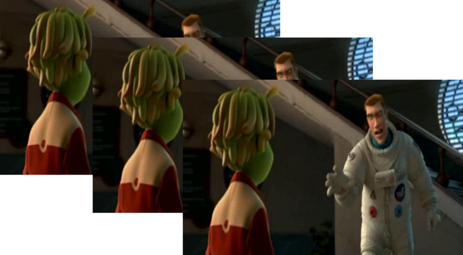

## 1.3. 视觉冗余

人类的视觉系统由于受生理特性的限制，对于图像场的注意是非均匀的，人对细微的颜色差异感觉不明显。 
例如，人类视觉的一般分辨能力为26灰度等级，而一般的图像的量化采用的是28灰度等级，即存在视觉冗余。 
人类的听觉对某些信号反映不太敏感，使得压缩后再还原有允许范围的变化，人也感觉不出来。

## 2.数据压缩方法的分类

### 2.1. 按照压缩方法是否产生失真分类

#### 2.1.1 无失真压缩

无失真压缩要求解压以后的数据和原始数据完全一致。解压后得到的数据是原数据的复制，是一种可逆压缩。 
无失真压缩法去掉或减少数据中的冗余，恢复时再重新插到数据中，因此是可逆过程 
根据目前的技术水平，无损压缩算法一般可以把普通文件的数据压缩到原来的1/2－1/4。

一些常用的无损压缩算法有**赫夫曼(Huffman)算法**和**LZW(Lenpel-Ziv & Welch)压缩算法**

#### 2.1.2 有失真压缩

解压以后的数据和原始数据不完全一致，是不可逆压缩方式。有失真压缩还原后，不影响信息的表达 
例如，图像、视频、音频数据的压缩就可以采用有损压缩方法，因为其中包含的数据往往多于我们的视觉系统和听觉系统所能接收的信息，丢掉一些数据而不至于对声音或者图像所表达的意思产生误解，但可大大提高压缩比。图像、视频、音频数据的压缩比可高达100:1，但人的主观感受仍不会对原始信息产生误解。

### 2.2 按照压缩方法的原理分类

#### 2.2.1 预测编码

基本思想是利用已被编码的点的数据值，预测邻近的一个像素点的数据值

#### 2.2.2 变换编码

基本思想是将图像的光强矩阵变换到系数空间上，然后对系数进行编码压缩

#### 2.2.3 统计编码

根据信息出现概率的分布特性而进行的压缩编码。比如霍夫曼编码。

## 3. 图像压缩的要素

**压缩比 **
压缩前后文件大小之比，越高越好，但受速度、消耗资源等的影响。 
**图像质量** 
还原后与原图像相比，评估的方法有客观评估和主观评估。 
**压缩与解压缩速度**
与压缩方法和压缩编码的算法有关，一般压缩比解压缩计算量大，因而压缩比解压缩慢。

## 4. 图像压缩编码举例

### 4.1 行程编码（RLE）

这是最好理解的一种编码了。 
现实中有许多这样的图像，在一幅图像中具有许多颜色相同的图块。在这些图块中，许多行上都具有相同的颜色，或者在一行上有许多连续的像素都具有相同的颜色值。在这种情况下就不需要存储每一个像素的颜色值，而仅仅存储一个像素的颜色值，以及具有相同颜色的像素数目就可以，或者存储像素的颜色值，以及具有相同颜色值的行数。 
这种压缩编码称为**行程编码(run length encoding，RLE)**，具有相同颜色并且是连续的像素数目称为行程长度。 

例如,字符串AAABCDDDDDDDDBBBBB 
利用RLE原理可以压缩为3ABC8D5B 
RLE编码简单直观，编码/解码速度快， 
因此许多图形和视频文件，如.BMP .TIFF及AVI等格式文件的压缩均采用此方法. 
由于一幅图像中有许多颜色相同的图块，用一整数对存储一个像素的颜色值及相同颜色像素的数目（长度）。例如： 
（G ，L）//G为颜色值，L为长度值 
编码时采用从左到右，从上到下的排列，每当遇到一串相同数据时就用该数据及重复次数代替原来的数据串。

举例，如下的18*7的像素（假设只有灰度值，1字节） 
000000003333333333 
222222222226666666 
111111111111111111 
111111555555555555 
888888888888888888 
555555555555553333 
222222222222222222 

仅仅需要11对数据表示。 
(0,8) (3,10) (2,11) (6,7) 
(1,18) (1,6) (5,12) (8,18) 
(5,14) (3,4) (2,18)

**游程长度编码特点**： 
- 直观，经济； 
- 是一种无损压缩； 
- 压缩比取决于图像本身特点，相同颜色图像块越大，图像块数目越少，压缩比越高。 
- 适用于计算机生成的图像，例如。BMP、TIF等，不适于颜色丰富的自然图像。

这并不是说RLE编码方法不适用于自然图像的压缩，相反，在自然图像的压缩中少不了RLE，只不过是不能单纯使用RLE一种编码方法，需要和其他的压缩编码技术联合应用。

### 4.2 哈夫曼编码（Huffman)

由于图像中表示颜色的数据出现的概率不同，对于出现频率高的赋（编）予较短字长的码，对出现频率小的编于较长字长的码，从而减少总的代码量，但不减少总的信息量。

编码步骤： 
(1)初始化，根据符号概率的大小按由大到小顺序对符号进行排序 
(2)把概率最小的两个符号组成一个节点，如图4-02中的D和E组成节点P1。 
(3)重复步骤2，得到节点P2、P3和P4，形成一棵“树”，其中的P4称为根节点。 
(4)从根节点P4开始到相应于每个符号的“树叶”，从上到下标上“0”(上枝)或者“1”(下枝)，至于哪个为“1”哪个为“0”则无关紧要，最后的结果仅仅是分配的代码不同，而代码的平均长度是相同的。 
(5)从根节点P4开始顺着树枝到每个叶子分别写出每个符号的代码。

## 4.3 DCT编码

### 4.3.1 基本概念

将在空域上描述的图象，经过某种变换（通常采用，余弦变换、傅立叶变换、沃尔什变换等），在某种变换域里进行描述。 
在变换域里，首先降低了图象的相关性；其次通过某种图象处理（如频域的二维滤波）以及熵编码，则可进一步压缩图象的编码比特率。 
这种变换常用于JPEG图像压缩。

### 4.3.2 变换压缩原理框图

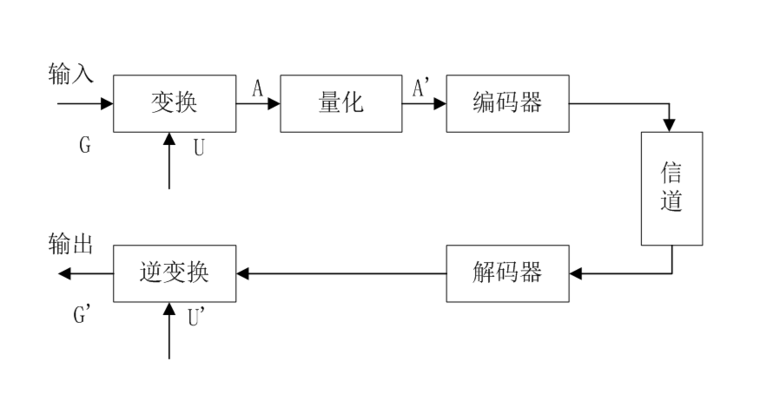

G : 输入源图像 
G’ :解码后的图像 
U： 二维正交变换 
U’ : 二维正交逆变换

## 5. 静止图像编码国际标准JPEG

1）JPEG基本系统 
2）FDCT和IDCT 
3）量化与反量化 
4）对量化系数的处理和组织 
5）熵编码 
6）应用举例

### 1）JPEG基本系统 
以8*8的图象块为基本单位进行编码； 
将RGB转换为亮度-色调-饱和度系统，并重新采样； 
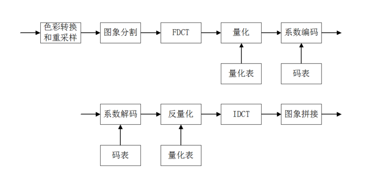

YIQ（NTSC制）与YUV（PAL制） 
Y：指颜色的明视度、亮度、灰度值；I或U：指色调；Q或V：指饱和度。 
Y=0.299R+0.587G+0.114B 
I=0.596R-0.247G-0.322B 
Q=0.211R-0.523G+0.312B 
U=0.148R-0.289G+0.473B 
V=0.615R-0.515G-0.1B

思想：**人对亮度比对色彩敏感**，在光线不足的情况下，所观察物体都是黑白的。因此可以**对色调和饱和度做粗略处理。 **

方法：对8\*8图象块矩阵，Y成分数据不变，U每2\*2个数据求平均，V每2\*1个数据求平均。称为YUV421系统。 
除此,还有YUV422, 411, 420等系统. 

### 2）FDCT与IDCT 

思想：人眼对低频数据比对高频数据敏感。 
根据8*8的二维DCT定义 

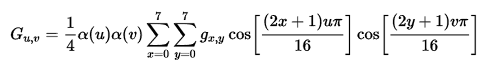

其中：0<= u, v < 8 
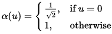

a(v) = a(u) 
 是输入8*8像素的坐标。 
 是输出的8*8变换结果的坐标。

称F（0,0）为直流系数，其他为交流系数。 
JPEG标准不规定FDCT和IDCT的算法。 
不要把上式看的有多难，其实对于离散余弦变换的原理，都不用关心，只要知道，上式其实就是矩阵运算。 
可以写成： 

并且A和A转置矩阵都是已知的。所以，说白了，就是个矩阵运算。

### 3）量化与反量化 

思想：将每个DCT系数除以各自量化步长并四舍五入后取整，得到量化系数。 
JPEG系统分别规定了亮度分量和色度分量的量化表，显然色度分量相应的量化步长比亮度分量大。 

### 4）对量化系数的处理和组织 

思想：JPEG采用定长和变长相结合的编码方法。 
直流系数：通常相邻8*8图象块的DC分量很接近，因此JPEG对量化后的直流分量采用无失真DPCM编码。通常JPEG要保存所需比特数和实际差值。

交流系数：经过量化后，AC分量出现较多的0。JPEG采用对0系数的行程长度编码。而对非0值，则要保存所需数和实际值。 
ZIG-ZAG排序：为使连续的0个数增多，采用Z形编码。 
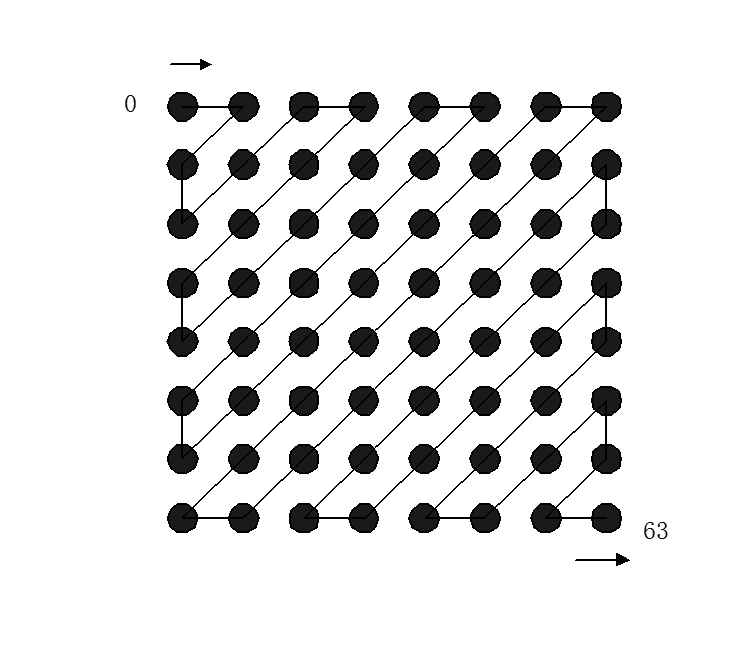

### 5）熵编码 

对于直流系数的差值，采用Huffman编码。JPEG标准为亮度和色度分量分别拟定了Huffman码表。 
对于交流0系数的行长，采用Huffamn编码。同样JPEG标准为亮度和色度分量分别拟定了Huffman码表。 
计算每象素的平均比特称为码率。 
0.25——0.50 图象质量中等，满足某些应用 
0.50——0.75 质量好，满足多数应用 
0.75——1.50 极好，满足大多数应用 
1.50——2.0 与原始图象质量一样

### 6）应用举例 

Lenna图象的一个8*8方块 
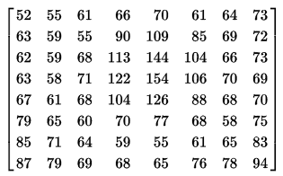

由于RGB是0~255，为了减小波动，先把数值移位一下，变成-128~127.()

接着，根据DCT变换公式。 
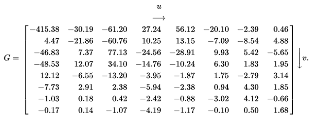

根据亮度量化表量化后得到的量化系数矩阵 

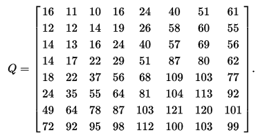

获得结果：

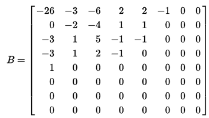

可见，新的数据，很小，很多是0。正如上文所说，这么多0，完全可以用游程编码，大大缩小数据量。

解码。 
**重点内容 **
先游程编码恢复为 

然后，根据量化表，恢复 

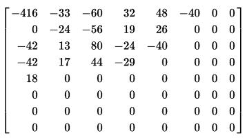

再根据反离散余弦变换 

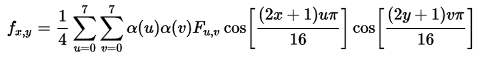

结果 

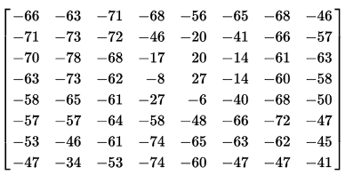

再右移127，恢复原始。

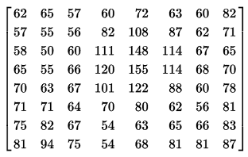

和原始图像的数据相比，基本是一样的，或者近似的！

编码比特率与质量因子 
通常在图象传输时要求固定比特率，JPEG通过设定一个质量控制因子Q，在量化时用该因子与量化表中的量化步长相乘作为实际的量化步长。 
则要求较高比特率时，Q取较小值如0.1；否则取大值。Q与比特流一起传送给解码端。

简单的说，压缩比例是可以控制的，只不过图像质量会变差。比如。 
**压缩率：10 **

**压缩率：50 **

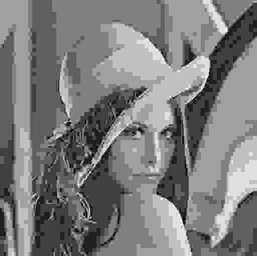