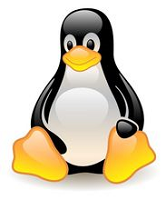

## 简述
Linux是一套自由加开放源代码的类Unix操作系统，诞生于1991年10月5日（第一次正式向外公布），由芬兰学生林Linus Torvalds和后来陆续加入的众多爱好者共同开发完成。

Linux是一个基于POSIX和Unix的多用户、多任务、支持多线程和多CPU的操作系统。它能运行主要的Unix工具软件、应用程序和网络协议。它支持32位和64位硬件。Linux继承了Unix以网络为核心的设计思想，是一个性能稳定的多用户网络操作系统。

Linux存在着许多不同的Linux版本，但它们都使用了Linux内核。Linux可安装在各种计算机硬件设备中，比如手机、平板电脑、路由器、视频游戏控制台、台式计算机、大型机和超级计算机。

严格来讲，Linux这个词本身只表示Linux内核，但实际上人们已经习惯了用Linux来形容整个基于Linux内核，并且使用GNU工程各种工具和数据库的操作系统。


## Linux之父
林纳斯·托瓦兹（Linus Torvalds）


Linus Torvalds被称作Linux之父，著名的电脑程序员、黑客。Linux内核的发明人及该计划的合作者。他利用个人时间及器材创造出了这套当今全球最流行的操作系统内核之一。现受聘于开放源代码开发实验室（OSDL：Open Source Development Labs, Inc），全力开发Linux内核。

Linux是一个诞生于网络、成长于网络且成熟于网络的奇特的操作系统。1991年，当时还是芬兰大学生得Linus Torvalds萌发了开发一个自由的Unix操作系统的想法，当年，Linux就诞生了，为了不让这个羽毛未丰的操作系统矢折，Linus Torvalds将自已的作品Linux通过Internet发布。从此一大批知名的、不知名的电脑黑客、编程人员加入到开发过程中来，一场声势浩大的运动由运而生，Linux逐渐成长起来。

Linux一开始是要求所有的源码必须公开，并且任何人均不得从Linux交易中获利。然而这种纯粹的自由软件的理想对于Linux的普及和发展是不利的，于是Linux开始转向GPL，成为GNU阵营中的主要一员。

Linux凭借优秀的设计、不凡的性能，加上IBM、Intel、CA、CORE、Oracle等国际知名企业的大力支持，市场份额逐步扩大，逐渐成为主流操作系统之一。

## Linux标志
苹果的标志是一只被咬了一口的苹果，微软的标志是一面窗户（至少最初是的），而Linux的标志（吉祥物）则是一只名叫Tux的企鹅。



企鹅的来源
1994年发表Linux正式核心1.0的时候，大家要Linus Torvalds想一只吉祥物，Linus Torvalds想起曾经在澳大利亚的一个动物园里被企鹅咬过，干脆就以企鹅来当吉祥物了！

更容易接受的说法是：企鹅代表南极，而南极又是全世界共有个一块陆地，不属于任何国家。也就是说Linux不属于任何商业公司，是全人类每个人都可以分享的一项技术成果。

## Tux来源
大多数人相信，“Tux”这个名字来源于Torvalds UniX，而不是因为它看起来像是穿着一件晚礼服(tuxedo)。也有说法称Tux这个名字则来自James Hughes：　

```text
Re: Let’s name the penguin! (was: Re: Linux 2.0 really is 
released..)　.James Hughes

Mon, 10 Jun 1996 20:25:52 -0400　.

(T)orvalds (U)ni(X) –> TUX!

Tux: Linux吉祥物/Logo Tux: Linux吉祥物/Logo
```

## 历史
###Unix
Unix操作系统是一个强大的多用户、多任务操作系统，支持多种处理器架构，按照操作系统的分类，属于分时操作系统，最早由KenThompson、Dennis Ritchie和Douglas McIlroy于1969年在AT&T的贝尔实验室开发。目前它的商标权由国际开放标准组织所拥有，只有符合单一Unix规范的Unix系统才能使用Unix这个名称，否则只能称为类Unix（Unix-like）。

### GNU
GNU是自由软件之父Richard Stallman在1984年组织开发的一个完全基于自由软件的软件体系，与此相应的有一分通用公共许可证（General Public License，简称GPL）。Linux以及与他有关的大量软件是在GPL的推动下开发和发布的。

自由软件之父 - Richard Stallman 像一个神态庄严的传教士一样喋喋不休地到处传播自由软件的福音，阐述他创立GNU的梦想：“自由的思想，而不是免费的午餐”。这位自由软件的“顶级神甫”为自己的梦想付出了大半生的努力，他不但自己创作了许多自由软件如GCC和GDB，在他的倡导下，目前人们熟悉的一些软件如BIND、Perl、Apache、TCP/IP等都成了自由软件的经典之作。

如果说Richard Stallman创立并推动了自由软件的发展，那么，Linus Torvalds毫不犹豫奉献给GNU的Linux，则把自由软件的发展带入到一个全新的境界。

### BSD
386BSD因为法律问题直到1992年还不能发布，NetBSD和FreeBSD是386BSD的后裔，比Linux早。Linus Torvalds说，当时如果有自由的基于386的Unix-like操作系统，他就可能不会创造Linux。尽管无法预料这给以后的软件业究竟造成了什么样的影响（如果没有这个法律纠纷，很有可能没有今天的革命性的Linux），但有一点可以肯定，Linux更加丰富了这块土壤。

### Minix
Minix是一种基于微内核架构的类Unix计算机操作系统，由Andrew S. Tanenbaum发明。Minix最初发布于1987年，开放全部源代码给大学教学和研究工作。2000年重新改为BSD授权，成为自由和开放源码软件。

因为AT&T的政策改变，在Version 7 Unix推出之后，发布新的使用条款，将Unix源代码私有化，在大学中不再能使用Unix源代码。教授为了能在课堂上教授学生操作系统运作的实务细节，决定在不使用任何AT&T的源代码前提下，自行开发与Unix兼容的操作系统，以避免版权上的争议。他以小型Unix（mini-Unix）之意，将它称为Minix。

Minix没有任何代码抄袭Unix，所以它们之间并没有任何继承关系，Minix作为当时有史以来的第一个开源的操作系统放到网上以后，短期之内得到了飞速发展，大量的人进行下载学习。

由于Minix是教授一人所写，所以存在一些漏洞。这时候有使用者发现漏洞存在，想着去下载一些补丁或者自己写一些补丁来修补这些漏洞，修补之后发现效果不错，然后就建议教授利用这些补丁完善下Minix，结果呢，教授比较固执，意思是说：为了维持Minix的纯洁性，不需要任何外来代码。也就是说，根本不打算做商业发行，所以Minux保持了其最原始的风范。

### Linux
在后来的几年内，由于计算机硬件工业的强力运作，以Intel主导的x86系统架构的个人计算机大行其道，所以个人计算机算是相当流行的一个机器了。但在此时，人们使用的大多还是DOS操作系统。此时，芬兰赫尔辛基大学有个叫Linus Torvalds的学生做了件不寻常的事情。当时他正好有一台386的计算机，由于并不喜欢自己电脑上的DOS系统，所以就想，既然Minix这么棒、这么稳定，那我何不将它移植到个人计算机 （好在由于Stallman提倡的Open Source理念，他得以接触到一些Source Code，而经由这样的一个想法，O(∩_∩)O~他就很有心的读取了Unix核心，并且去除较为繁复的核心程序，将它改写成可以适用于一般个人计算机的x86系统上面）。

到了1991年，他终于将0.02版的原始码hobby放到网络上面供大家下载，并且由于hobby受到大家的肯定，相当多的朋友一起投入这个工作中。终于在1994年将第一个完整的核心Version 1.0释出，并且造成目前的大流行。。。由于Linux kernel的发展是由虚拟团队所达成的，大家都是透过网络取得Linux的核心原始码，经由自己精心改造后再回传给Linux社群，进而一步一步的发展完成完整的Linux系统，至于Linus Torvalds是这个集团中的发起者。由于这个群策群力的缘故，Linus Torvalds将Linux定为同样造福大家的GNU授权模式！

Linux是Linus Torvalds受到Minix的影响而作成的。但在设计哲学上，Linux则和Minix大相迳庭。Minix在内核设计上采用微内核的原则，但Linux则和原始的Unix相同都采用宏内核的概念。在Linux发展之初，双方还于1992年在新闻组上有过一场精彩的理念争论。Minix的作者和支持者认为Linux的单内核构造是“向七十年代的大倒退”，而Linux的支持者认为Minix本身没有实用性。

## 主要特性
- 基本思想
Linux的基本思想有两点：

1. 一切都是文件。
2. 每个软件都有确定的用途。
其中第一条详细来讲就是系统中的所有都归结为一个文件，包括命令、硬件和软件设备、操作系统、进程等等对于操作系统内核而言，都被视为拥有各自特性或类型的文件。至于说Linux是基于Unix的，很大程度上也是因为这两者的基本思想十分相近。

- 完全免费
Linux是一款免费的操作系统，用户可以通过网络或其他途径免费获得，并可以任意修改其源代码。这是其他的操作系统所做不到的。正是由于这一点，来自全世界的无数程序员参与了Linux的修改、编写工作，程序员可以根据自己的兴趣和灵感对其进行改变，这让Linux吸收了无数程序员的精华，不断壮大。

- 完全兼容POSIX1.0标准
这使得可以在Linux下通过相应的模拟器运行常见的DOS、Windows的程序。这为用户从Windows转到Linux奠定了基础。许多用户在考虑使用Linux时，就想到以前在Windows下常见的程序是否能正常运行，这一点就消除了他们的疑虑。

- 多用户、多任务
Linux支持多用户，各个用户对于自己的文件设备有自己特殊的权利，保证了各用户之间互不影响。多任务则是现在电脑最主要的一个特点，Linux可以使多个程序同时并独立地运行。

- 良好的界面
Linux同时具有字符界面和图形界面。在字符界面用户可以通过键盘输入相应的指令来进行操作。它同时也提供了类似Windows图形界面的X-Window系统，用户可以使用鼠标对其进行操作。在X-Window环境中就和在Windows中相似，可以说是一个Linux版的Windows。

- 支持多种平台
Linux可以运行在多种硬件平台上，如具有x86、680x0、SPARC、Alpha等处理器的平台。此外Linux还是一种嵌入式操作系统，可以运行在掌上电脑、机顶盒或游戏机上。2001年1月份发布的Linux 2.4版内核已经能够完全支持Intel 64位芯片架构。同时Linux也支持多处理器技术。多个处理器同时工作，使系统性能大大提高。

## Linux内核版本
Linux内核官网：https://www.kernel.org/

Linux内核使用三种不同的版本编号方式。

用于1.0版本之前（包括1.0）。第一个版本是0.01，紧接着是0.02、0.03、0.10、0.11、0.12、0.95、0.96、0.97、0.98、0.99和之后的1.0。

用于1.0之后到2.6，数字由三部分“A.B.C”，A代表主版本号，B代表次主版本号，C代表较小的末版本号。只有在内核发生很大变化时（历史上只发生过两次，1994年的1.0、1996年的2.0），A才变化。可以通过数字B来判断Linux是否稳定，偶数的B代表稳定版，奇数的B代表开发版。C代表一些bug修复，安全更新，新特性和驱动的次数。

以版本2.4.0为例，2代表主版本号，4代表次版本号，0代表改动较小的末版本号。在版本号中，序号的第二位为偶数的版本表明这是一个可以使用的稳定版本，如2.2.5，而序号的第二位为奇数的版本一般有一些新的东西加入，是个不一定很稳定的测试版本，如2.3.1。这样稳定版本来源于上一个测试版升级版本号，而一个稳定版本发展到完全成熟后就不再发展。

从2004年2.6.0版本开始，使用一种“time-based”的方式。3.0版本之前，是一种“A.B.C.D”的格式。这些年里，前两个数字A.B即“2.6”保持不变，C随着新版本的发布而增加，D代表一些bug修复、安全更新、添加新特性和驱动的次数。3.0版本之后是“A.B.C”格式，B随着新版本的发布而增加，C代表一些bug修复、安全更新、新特性和驱动的次数。

第三种方式中不再使用偶数代表稳定版，奇数代表开发版这样的命名方式。举个例子：3.7.0代表的不是开发版，而是稳定版！

## Linux发行版

Linux主要作为Linux发行版（通常被称为”distro”）的一部分而使用。这些发行版由个人、松散组织的团队、以及商业机构和志愿者组织编写。它们通常包括了其他的系统软件和应用软件，以及一个用来简化系统初始安装的安装工具，和让软件安装升级的集成管理器。大多数系统还包括了像提供GUI界面的XFree86之类的曾经运行于BSD的程序。 一个典型的Linux发行版包括：Linux内核、一些GNU程序库和工具、命令行shell、图形界面的X Window系统和相应的桌面环境，如：KDE或GNOME，并包含数千种从办公套件、编译器、文本编辑器到科学工具的应用软件。

由于发展的Linux公司实在太多了，例如著名的Red Hat、OpenLinux、Mandrake 、Debian、SuSE等。所以很多人都很担心，如此一来每个 distribution（安装套件）是否都不相同呢？这就不需要担心了，由于各个distribution都是架构在Linux Kernel下来发展属于自己公司风格的distribution，因此大家都遵守Linux Standard Base ( LSB 的规范，也就是说，各个distribution其实都差不多，用到的都是Linux Kernel，只是各个distribution里面所使用的各套件可能并不完全相同而已）。

下面，列出几个主要的 Linux 发行网址：

Red Hat：http://www.redhat.com
Mandrake：http://www.linux-mandrake.com/en/
Slackware：http://www.slackware.com/
SuSE：http://www.suse.com/index_us.html
OpenLinux：http://www.caldera.com/
Debian：http://www.debian.org/
Linpus：http://www.linpus.com.tw/
UniteLinux：http://www.sco.com/unitedlinux/