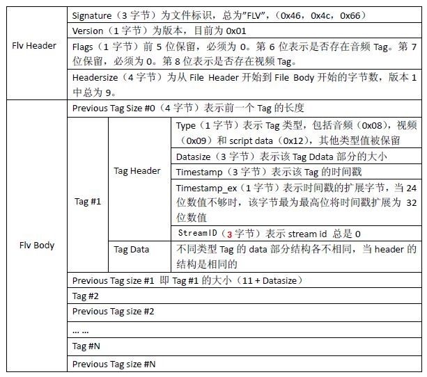
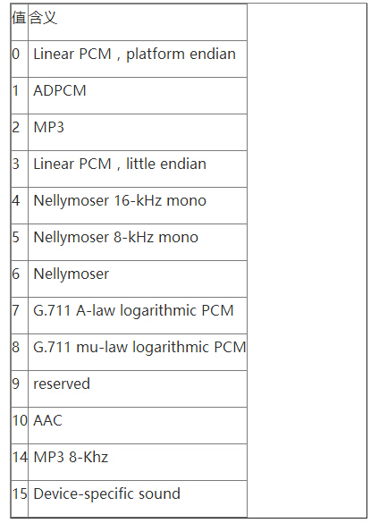
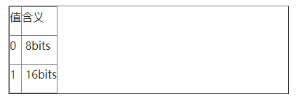
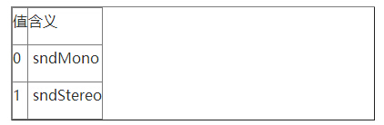
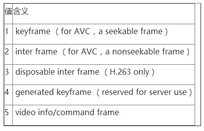
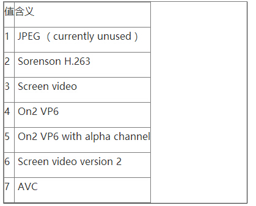
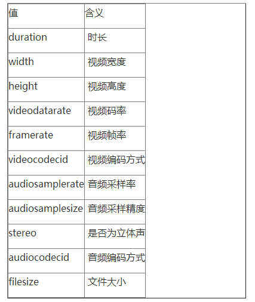

# FLV格式解析

## FLV封装原理
FLV格式的封装原理，贴上来辅助学习之用。

FLV（Flash Video）是Adobe公司设计开发的一种流行的流媒体格式，由于其视频文件体积轻巧、封装简单等特点，使其很适合在互联网上进行应用。此外，FLV可 以使用Flash Player进行播放，而Flash Player插件已经安装在全世界绝大部分浏览器上，这使得通过网页播放FLV视频十分容易。目前主流的视频网站如优酷网，土豆网，乐视网等网站无一例外 地使用了FLV格式。FLV封装格式的文件后缀通常为“.flv”。

总体上看，FLV包括文件头（File Header）和文件体（File Body）两部分，其中文件体由一系列的Tag组成。因此一个FLV文件是如图1结构。

图1.文件结构（简图）

其中，每个Tag前面还包含了Previous Tag Size字段，表示前面一个Tag的大小。Tag的类型可以是视频、音频和Script，每个Tag只能包含以上三种类型的数据中的一种。图2展示了FLV文件的详细结构。

图2.FLV文件结构（详图）

## 三种Tag的Tag Data

下面详细介绍一下三种Tag的Tag Data部分的结构。

### (a)Audio Tag Data结构（音频Tag）

音频Tag开始的第1个字节包含了音频数据的参数信息，从第2个字节开始为音频流数据。结构如图3所示。

图3.Audio Tag Data结构

- 第1个字节的前4位的数值表示了音频编码类型。如表1所示。

表1.音频编码类型

- 第1个字节的第5-6位的数值表示音频采样率。如表2所示。

表2.音频采样率

PS：从上表可以发现，FLV封装格式并不支持48KHz的采样率。

- 第1个字节的第7位表示音频采样精度。如表3所示。

表3.音频采样精度

- 第1个字节的第8位表示音频类型。

表4. 音频类型

## (b)Video Tag Data结构（视频Tag）

视频Tag也用开始的第1个字节包含视频数据的参数信息，从第2个字节为视频流数据。结构如图4所示。

图4.Video Tag Data结构

- 第1个字节的前4位的数值表示帧类型。如表5所示。

表5.帧类型

- 第1个字节的后4位的数值表示视频编码类型。如表6所示。

表6.视频编码类型

## (c)Script Tag Data结构（控制帧）

该类型Tag又通常被称为Metadata Tag，会放一些关于FLV视频和音频的元数据信息如：duration、width、height等。通常该类型Tag会跟在File Header后面作为第一个Tag出现，而且只有一个。结构如图5所示。

图5.Script Tag Data结构

第一个AMF包：

第 1个字节表示AMF包类型，一般总是0x02，表示字符串。第2-3个字节为UI16类型值，标识字符串的长度，一般总是 0x000A（“onMetaData”长度）。后面字节为具体的字符串，一般总为“onMetaData” （6F,6E,4D,65,74,61,44,61,74,61）。

第二个AMF包：

第1个字节表示AMF包类型，一般总是0x08，表示数组。第2-5个字节为UI32类型值，表示数组元素的个数。后面即为各数组元素的封装，数组元素为元素名称和值组成的对。常见的数组元素如表7所示。

表7.常见MetaData
