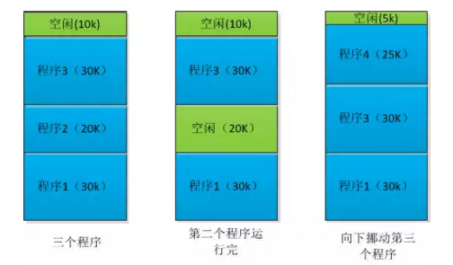
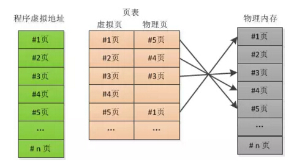
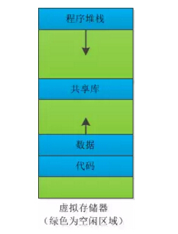
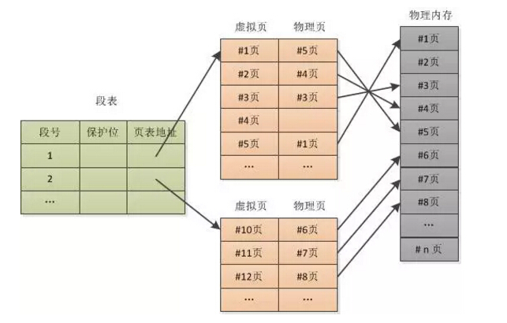

# CPU阿甘之烦恼

## 一、批处理系统

CPU阿甘最近很烦。 

原因很简单，内存和硬盘看他不顺眼。

阿甘心里很清楚， 是自己干活太快了，干完了活就歇着喝茶，这时候内存和硬盘还在辛辛苦苦的忙活，他们肯定觉得很不爽了。　 

中国有句古话叫什么来着？　“木秀于林，风必摧之”，“不患贫而患不均”，这就是阿甘的处境。　

虽然阿甘自己也于心不忍， 可是有什么办法？谁让他们那么慢 ！一个比自己慢100倍， 另外一个比自己慢100万倍！

这个世界的造物主为什么不把我们的速度弄的一样呢？

阿甘所在的是一个**批处理的计算机系统**， 操作系统老大收集了一批任务以后，就会把这一批任务的程序逐个装载的内存中，让CPU去运行，大部分时候这些程序都是单纯的科学计算，计算弹道轨迹什么的， 但有时候也会有IO相关的操作，这时候，内存和硬盘都在疯狂的加班Load数据， 可是阿甘只能等待数据到来，只能坐那儿喝茶了。 

没多久， 内存向操作系统老大告了阿甘一状， 阿甘被老大叫去训话了： “阿甘，你就不能多干一点？  老是歇着喝茶算是怎么回事？”

阿甘委屈的说： “老大， 这不能怪我啊， 你看你每次只把一个程序搬到内存那里 让我运行， 正常情况下，我可以跑的飞快， 可以是一旦遇到IO相关的指令，势必要去硬盘那里找数据，硬盘实在是太慢了， 我不得不等待啊”

操作系统说： “卧槽， 听你的口气还是我的问题啊，  一个程序遇到了IO指令， 你不能把它挂起，存到到硬盘里，然后再找另外一个运行吗？”

阿甘笑了：“老大我看你是气昏头了， 我要是把正在运行的程序存到硬盘里，暂时挂起，然后再从硬盘装载另外一个， 这可都是IO操作啊 ，岂不更慢？”

“这？！” 操作系统语塞了，沉默了半天说：“这样吧， 我以后在内存里多给你装载几个程序，一个程序被IO阻塞住了，  你就去运行另外一个如何？”

“这得问问内存，看他愿不愿意了， 我把内存叫来，我们一起商量商量” 阿甘觉得这个主意不错。

内存心思缜密，听了这个想法， 心想：自己也没什么损失啊，原来同一时间在内存里只有一个程序， 现在要装载多个，对我都一样。 

可是往深处一想，如果有多个程序，内存的分配可不是个简单的事情， 比如说下面这个例子：

图1 ：内存紧缩
(1) 内存一共90k, 一开始有三个程序运行，占据了80k的空间， 剩余10k

(2) 然后第二个程序运行完了， 空闲出来20k , 现在总空闲是30K, 但这两块空闲内存是不连续的。
 
(3) 第4个程序需要25k, 没办法只好把第三个程序往下移动， 腾出空间让第四个程序来使用了。

内存把自己的想法给操作系统老大说了说。 

老大说： 阿甘，你要向内存学习啊， 看看他思考的多么深入，不过这个问题我有解决办法， 需要涉及到几个内存的分配算法， 你们不用管了。 咱们就这么确定下来，先跑两个程序试试。  

## 二、地址重定位

第二天一大早，试验正式开始， 老大同时装载了两个程序到内存中：

图2：内存装入多个程序

第一个程序被装载到了内存的开始处，也就是地址０，运行了一会，遇到了一个IO指令，在等待数据的时候， 老大立刻让CPU开始运行第二个程序，这个程序被装载到了地址10000处， 刚开始运行的好好的， 突然就来了这么一条指令：
MOV AX  [1000] 

 (注： AX是一个寄存器， 你可以理解成在CPU内部的一个高速的存储单位， 这个指令的含义是把AX寄存器的值写到内存地址1000处)

阿甘觉得似曾相识， 隐隐约约的记得第一个程序中也这么一条类似的指令： MOV BX  [1000]

“老大，坏了， 这两个程序操作了同一个地址！ 数据会被覆盖掉 ！” 阿甘赶紧向操作系统汇报。 

操作系统一看就明白了，原来这个系统的程序引用的都是物理的内存地址， 在批处理系统中，所有的程序都是从地址0开始装载， 现在是多道程序在内存中， 第二个程序被装载到了10000这个地址，但是程序没有变化啊， 还是假定从0开始， 自然就出错了。 

“看来老大在装载的时候得修改一下第二个程序的指令了，把每个地址都加上10000（即第二个程序的开始处）， 原来的指令就会变成 MOV AX [11000] ” 内存确实反应很快。

（注： 直接修改程序的指令， 这叫**静态重定位**）

阿甘说： “ 如果用这种办法， 那做内存紧缩的时候可就麻烦了， 因为老大要到处移动程序啊， 对每个移动的程序岂不还都得做重定位？ 这多累啊！”

操作系统老大陷入了沉思， 阿甘说的没错， 这个静态重定位是很不方便， 看来想在内存中运行多道程序不是想象的那么容易。

但是能不能改变下思路，在运行时把地址重定位呢？

首先得记录下每个程序的起始地址， 可以让阿甘再增加一个寄存器，专门用来保存初始地址。 

例如对第一个程序，这个地址是 0 ，  对第二个程序，这个地址是10000， 

运行第一个程序的时候，把寄存器的值置为0 ， 当切换到第二个程序的时候，寄存器的值也应该切换成10000。 

只要遇到了地址有关的指令， 都需要把地址加上寄存器的值，这样才得到真正的内存地址，然后去访问。 

（注： 这叫**地址的动态重定位**）

操作系统赶紧让阿甘去加一个新的寄存器， 重新装载两个程序，记录下他们的开始地址，然后切换程序，这次成功了， 不在有数据覆盖的问题了。 

只是阿甘有些不高兴 ： “老大，这一下子我这里的活可多了不少啊， 你看每次访问内存， 我都得额外的做一次加法运算啊。”

老大说： “没办法，能者多劳嘛， 你看看我，我既需要考虑内存分配算法，还得做内存紧缩， 还得记住每个程序的开始地址， 切换程序的时候，才能刷新你的寄存器， 我比你麻烦多了！ ”

内存突然说到： ”老大， 我想到一个问题，假设有个不怀好意的恶意程序，它去访问别人的空间怎么办？  比如说地址2000 至 3000属于一个程序， 但是这个程序来了一条这样的指令 MOV AX [1500],  我们在运行时会翻译成 MOV AX [3500]  , 这个3500有可能是别的程序的空间啊“

“唉，那就只好再加个寄存器了，阿甘， 用这个新寄存器来记录程序在内存中的长度吧， 这样每次访问的时候拿那个地址和这个长度比较一下，我们就知道是不是越界了” 老大无可奈何了。 

“好吧” 阿甘答应了，“ 我可以把这连个寄存器，以及计算内存地址的方法，封装成一个新的模块，就叫MMU （内存管理单元）吧， 不过这个东西听起来好像应该内存来管啊”

内存笑着说： “那是不行的，阿甘， 能够高速访问的寄存器只有你这里才有啊 ， 我就是一个比你慢100倍的存储器而已！”。

## 三、分块装入程序

多道程序最近在内存中运行的挺好，阿甘没法闲下来喝茶了， 经常是一个还没运行完，很快就切换到另外一个。

那些程序也都是好事之徒，听说了这个新的系统，都拼了命，挤破头的往内存中钻。

内存很小，很快就会挤满， 操作系统老大忙于调度，也是忙的不可开交。 

更有甚者，程序开始越长越大，有些图形处理的程序，还有些什么叫Java的程序，动不动就要几百M内存， 就这还嚷嚷着说不够。 

操作系统头都大了，把CPU和内存叫来商量。 

“世风日下，人心不古啊” 内存一边叹气一遍说 “原来批处理的时候那些程序规规矩矩的，现在是怎么了？”

“这也不能怪那些程序， 现在硬件的确比原来好多了，内存，你原来只有几十K, 现在都好几G了，  CPU在摩尔定律的关照下，发展的更快，每隔18个月，你的速度就翻一翻”  操作系统老大说。

“那也赶不上这些程序的发展速度，他们对我要求越来越高， 可是把我累坏了” CPU垂头丧气的。 

“我们还是考虑下怎么让有限的内存装下更多的程序吧” 

“我有一个提议” 阿甘说 “**对每个程序，不要全部装入内存，要分块装载，例如先把最重要的代码指令装载进来，在运行中按需装载别的东西**。”

内存嘲笑说： “阿甘， 看来你又想偷懒喝茶了，哈哈， 如果每个程序都这样，IO操作得多频繁， 我和硬盘累死， 你就整天歇着吧”

阿甘脸红了， 沉默了。 

“慢着”老大说“阿甘，你之前不是发现过什么原理嘛， 就是从几千亿条指令中总结出的那个， 叫什么来着？”

“奥，那是局部性原理， 有两个：

(1)  时间局部性：如果程序中的某条指令一旦执行，则不久之后该指令可能再次被执行； 如果某数据被访问，则不久之后该数据可能再次被访问。

(2) 空间局部性：指一旦程序访问了某个存储单元，则不久之后。其附近的存储单元也将被访问。“

（注： 参见文章《CPU阿甘》，回复0005 阅读文章 ）

“这个局部性原理应该能拯救我们， 阿甘， 我们完全可以把一个程序分成一个个小块，然后按块来装载到内存中，由于局部性原理的存在， 程序会倾向于在这一块或几块上执行， 性能上应该不会有太大的损失。”

“这能行吗？ ” 内存和阿甘不约而同的问。

“试一试就知道了，这样我们把这一个个小块叫做**页框（page frame）**， 每个暂定4k大小， 装载程序的时候也按照页框大小来”

实验了几天， 果然不出老大所料， 那些程序在大部分时间真的只运行在几个页框中，  于是老大把这些页称为**工作集(working set)**

## 四、虚拟内存：分页

“既然一个程序可以用分块的技术逐步调入内存，而不太影响性能， 那就意味着，**一个程序可以比实际的内存大的多啊**”

阿甘躺在床上，突然间想到这一层， 心头突突直跳， 这绝对是一个超级想法。 

“我们可以给每个程序都提供一个超级大的空间，例如4G，只不过这个空间是虚拟的， 程序中的指令使用的就是这些虚拟的地址，然后我的MMU把它们映射到真实的物理的内存地址上， 那些程序们浑然不觉，哈哈，实在是太棒了”

（注： 这就是我常说的增加一个中间层来解决问题）

内存听说了这个想法，惊讶的瞪大了双眼： “阿甘，你疯了吧”

“阿甘的想法是有道理的” 老大说 “只是我们还要坚持一点， 那就是分块装入程序， 我们把虚拟的地址也得分块，就叫做页（page）, 大小和物理内存的 页框一样， 这样好映射。”

“老大，看来你又要麻烦了， 你得维持一个页表， 用来映射虚拟页面和物理页面”

“不仅如此， 我还得记录一个程序那些页已经被装载到了物理内存， 那些没有被装载，如果程序访问了这些没被装载的页面，我还得从内存中找到一块空闲的地方， 如果内存已满， 只好把现有的页框置换一个到硬盘上了， 可是，怎么确定那个物理内存的页框可以置换呢？ 唉， 又涉及到很多复杂的算法，需要大费一番周折。 你看看，老大不是这么容易当的。”

图3： 分页

（ 这就是分页的工作原理，需要注意的是**虚拟地址的#4页， 在物理内存中不存在，如果程序访问第4页，就会产生缺页的中断，由操作系统去硬盘调取**）

内存想起来一个问题：  “如果程序运行时，每次都得查页表来获得物理的内存页， 而页表也是在内存里， 而我比你慢100倍， 你受得了吗， 阿甘？”

阿甘笑了： “这个问题其实我也考虑了，所以我打算增强我的内存管理单元， 把那些最常访问的页表项放到缓存里， 这样不就快了吗。  ”

内存想想也是， 还是局部性原理， 太牛了。

## 五、分段+分页

分页系统运行了一段时间以后， 又有程序表示不爽了，这些程序嚷嚷着说：

“你们能不能把程序“分家”啊， 例如代码段，数据段，堆栈段，这多么自然， 并且有利于保护，要是程序试图去写这个只读的代码段， 立刻就可以抛出保护异常！”

还有程序说：“页面太小了，实在不利于共享，我和哥们共享的那个图形库， 高达几十M , 得分成好多页来共享，太麻烦了，你们要是做一个共享段该多好！”
......
这样的聒噪声多了， 大家都不胜其烦， 那就“分家”吧。 

当然对每个程序都需要标准化， 一个程序被分成代码段，数据段和堆栈段等， 操作系统老大记录下每个段的开始和结束地址，每个段的保护位。 

图4：Linux的虚拟内存示意图

但是在每个段的内部，仍然按分页的系统来处理，除了页表之外，操作系统老大又被迫维护了一个段表这样的东西 。

一个虚拟的内存地址来了以后，首先根据地址中的段号先找到相应的段描述表， 其中有页表的地址， 然后再从页表中找到物理内存， 过程类似这样：

图5：一个简化的段表和页表

所有事情都设置好了， 大家都喘了口气，觉得这样的结构大家应该没什么异议了。 

老大心情大好，觉得一切尽在掌握，他笑着对CPU阿甘说： 

“阿甘，从今天开始，如果有程序想非法的访问内存，例如一个不属于他的段， 我就立刻给他一个警告：Segmentation Fault !”

阿甘说：“那程序收到Segmentation Fault以后怎么处理？”

老大说： “通常情况下就被我杀死， 然后给他产生一个叫core dump的尸体，让那些码农们拿走分析去吧!”