# 空白页面/缺省数据页面应该如何设计?

在我经历的设计项目中，所有的项目成员都会要求设计师优先制做所谓的「典型页面」，常见的就是产品的首页和详情页。

而**空白页面**，或者说**缺省数据页面**（例如没有任何联系人的通讯录和没有任何聊天记录的微信），通常都是在设计过程的最后阶段才作考虑。有些时候，甚至会被遗忘。直到某个开发同学提出来，『这个页面，如果没有数据的时候，该显示什么鬼东西啊？』

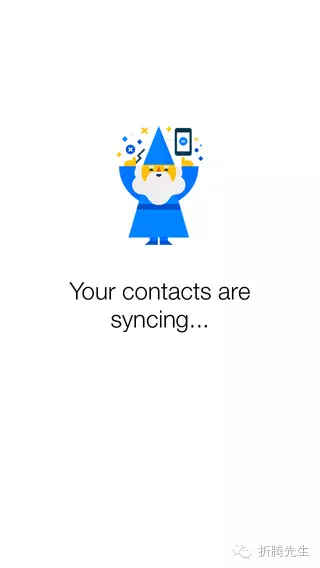

今天的这篇文章，作者从用户首次接触产品，还没有内容/数据/好友的情况入手，分析并总结了一些空白页面设计的思路，应该能给各位产品设计者带来灵感。下面进入正文。

用户「首次使用」你的产品时会遇到空白状态的页面，这也是用户由浅入深接触你的产品的必经之路。在这个过程中，一个优秀的空白页面应该达成三个目标：

1. 教育用户
2. 取悦用户
3. 引导用户

## 1. 教育你的用户

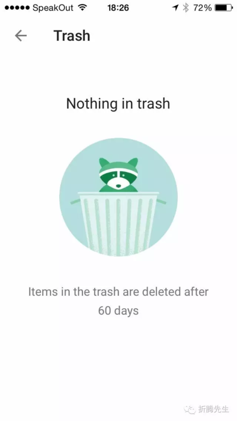

一个优秀的空白页面应该解决如下问题：

- 何物（What）：解释这个页面在说什么
- 何地（Where）：告知用户当前的位置，以及接下来可以干什么
- 何时（When）：解释此处空白在什么情况下将出现有效的数据

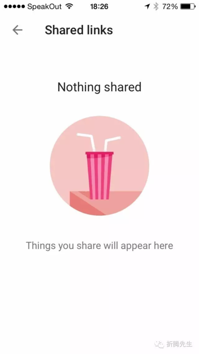

## 2. 取悦你的用户

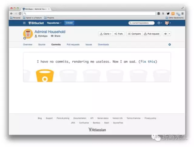

> 译注：这是 Bitbucket 的代码提交记录页面，当它为空时，网站的拟人化形象——一个小桶子用幽怨的口气说道，『我这里没有任何提交记录，这让我显得毫无用处。我感到很难过。』（解决这个问题）

优秀的第一印象不仅仅与可用性有关，它也与产品的调性有关。问你自己这几个问题：

- 你能让用户感到新鲜或者出乎意料吗？
- 你能让用户从心底绽开笑容吗？
- 你能让用户感受到你产品的优秀调性吗？

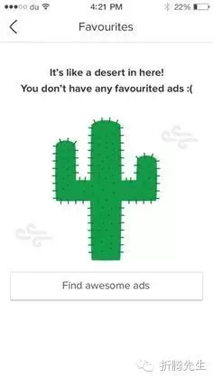

> 译注：一个仙人掌杵在那里，说道，『这儿看起来像是沙漠！你没有任何收藏的东西 :( 』接下还有一个引导用户去收藏的行动按钮。

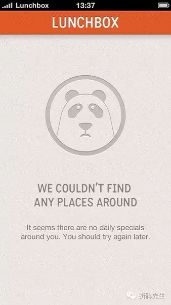

> 译注：一个略显苦逼的熊猫脸，说道，『我们在周围啥也没找到看起来你周围没有什么特别的事情发生。你可以过一阵子再试试这个功能。』

通过空白页面取悦用户，可以做这些：

- 品牌（On brand）：介绍并强化你的品牌元素
- 亮点（Different）：有创意或者展示你的幽默感
- 共鸣（Relatable）：展示你的产品温暖人性的一面

> 译注：看起来像是一个游戏的任务列表页面。一个潜水员在一条鲨鱼旁边，说道，『你还没有准备好，指挥官。回去再训练一下吧。』

## 3. 引导用户行动

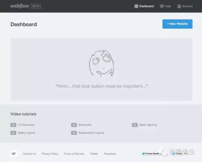

> 译注：一个小人若有所思的看着右上角，念道，『唔……那个蓝色的按钮肯定很重要』。

> 译注：『你还没有关注任何人。关注其他人可以查看他们收集的故事。你关注得越多，Flipboard 提供的服务就更好！』接下来就是一个引导用户去关注其他人的行动按钮。

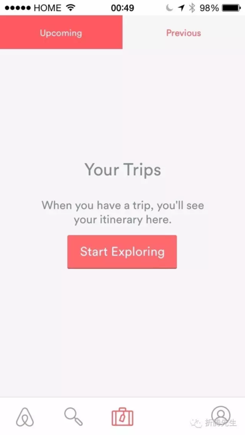

> 译注：『当你结束一次旅行，你会在这看到它。』接下来就是一个引导用户去探索的行动按钮。

在空白页面上引导用户的下一步行动，需要包含这三点：

- 动机（Motivate）：向目标用户展示激励性的语言，例如：『现在就开始！』
- 劝说（Persuade）：利益点不仅要在落地页上展示。当用户与你的产品交互时，也可以反复展示利益点。
- 直接（Direct）：在一开始就向用户展示唯一且最优的路径。提供行动按钮或者给出引导。在用户初次接触 app 时并不适合让他们做选择题。你应该让初次接触的体验尽可能的简单。假如刚开始就需要用户创建一些内容，你应该提供一些模板之类的东西让用户可以借鉴。

## 增加空白页面的投入吧

最棒的设计通常也是最具有挑战性的——它要求在信息呈现与操作上达成精巧的平衡。但是，一个空白状态的页面就可能阻断你的用户进一步探索你所设计的精妙界面。这些空白页面难道不值得你投入更多的时间和关注吗？

下面是一些不错的空白页设计：

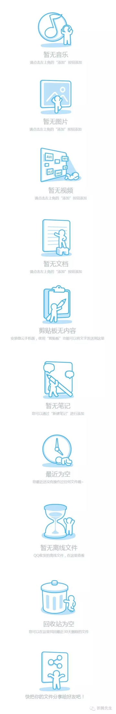
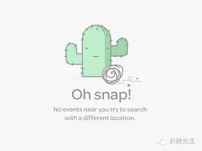
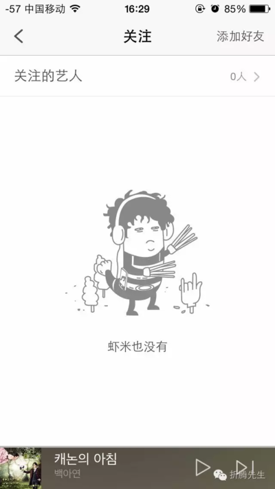
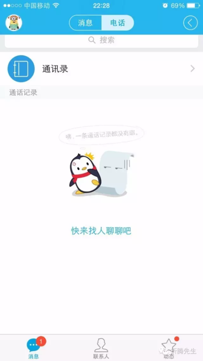
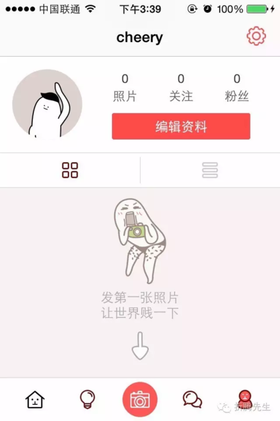
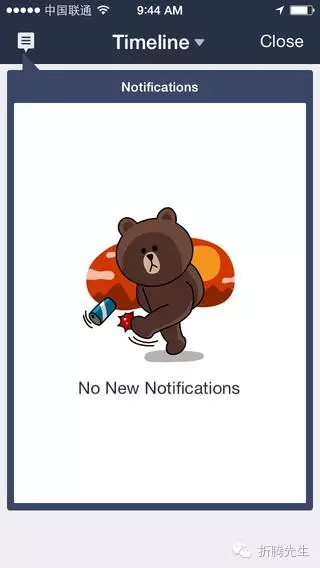